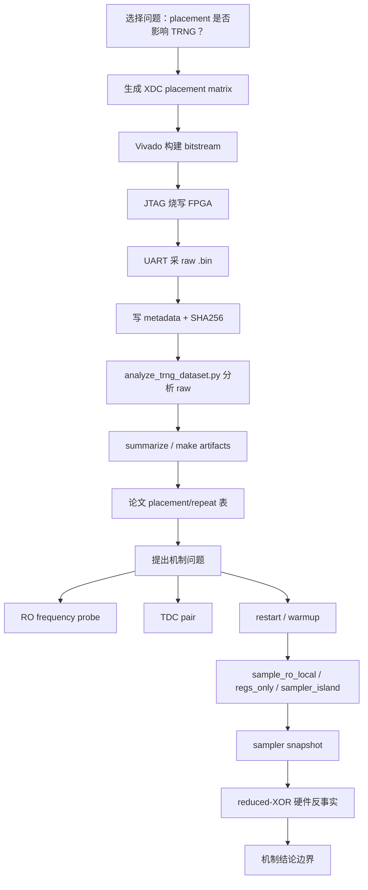

# RO_TRNG 零基础实验接手手册 20260529

本文档面向第一次接手本项目的人。目标不是只告诉你“运行哪个脚本”，而是说明每一步实验在验证什么、为什么要这么做、输入输出在哪里、怎样判断实验是否可靠。

项目目录假设为：

```powershell
E:\Project\MLDSA\RO_TRNG
```

## 0. 先理解这个项目在研究什么

本项目研究的是 FPGA 上的 RO-TRNG，也就是用 ring oscillator，简称 RO，做随机数发生器。

最核心的问题是：

> 同样的 TRNG 逻辑，只改变 FPGA 上 RO、采样 RO、采样寄存器和局部 routing 的物理实现，随机性会不会发生巨大变化？如果会，机制是什么？

当前实验链条已经从“观察 placement 会影响随机性”推进到“采样端 sampled-vector 的相关结构和 XOR 抵消关系决定最终输出质量”。

简单说，本文档里的所有实验都围绕这条链：

```text
改变 FPGA 物理摆放
    -> 采 UART 原始数据
    -> 统计随机性
    -> 排除简单频率/锁定解释
    -> 做 restart / warmup
    -> 做 sampler-side 反事实
    -> 做 reduced-XOR 硬件反事实
    -> 形成论文机制解释
```

## 1. 项目里最重要的概念

### 1.1 RO

RO 是 ring oscillator，环形振荡器。它由若干 LUT/反相结构组成，会自发振荡。

本项目里通常有两类 RO：

| 名称 | 作用 |
| --- | --- |
| data RO | 被采样的振荡源，通常有 8 个 |
| sample RO | 用来产生采样时机或采样节奏的 RO |

### 1.2 placement

placement 指把 LUT、寄存器等逻辑单元放在 FPGA 的具体位置。

在 Xilinx FPGA 里，常见定位单位是：

```text
SLICE_X44Y39
BEL A6LUT / B6LUT / C6LUT / D6LUT
```

一个 RO 的两个 LUT 如果被固定到某个 slice，就会在 XDC 里看到：

```tcl
set_property LOC SLICE_X44Y39 [get_cells ...]
set_property BEL A6LUT [get_cells ...]
```

### 1.3 raw `.bin`

UART 采回来的原始字节流就是 `.bin`。论文结果不能只看文档，必须能追到 `.bin`。

典型位置：

```text
data\hardware\20260511_fpga1_board1\trng\random1_run01.bin
```

### 1.4 metadata 和 SHA256

每次采集都应该有：

```text
xxx.bin
xxx.bin.sha256.txt
data\hardware\20260511_fpga1_board1\metadata\xxx.json
```

metadata 里应记录：

```text
capture_id
kind
output_file
bitstream
bytes_requested
bytes_captured
sha256
uart_port
baud
start_time
end_time
```

验证实验真实性时，必须重新算 `.bin` 的 SHA256，并和 sidecar、metadata、summary 表对比。

### 1.5 restart / warmup

普通连续流采集是：

```text
打开 FPGA -> 连续采 10MiB / 20MiB
```

restart 采集是：

```text
第 0 次 restart: 取 1000 bit
第 1 次 restart: 取 1000 bit
...
第 999 次 restart: 取 1000 bit
```

项目里常见格式是：

```text
8-byte header + 1000 x 125-byte payload = 125008 bytes
```

因为：

```text
125 bytes = 1000 bits
```

warmup 指每次 restart 后先丢掉一段启动数据，再开始取样。例如 `warmup10` 表示启动后先跳过 10 个 warmup 单位。

### 1.6 regs-only / sample-ro-local / sampler-island

这些是采样端反事实实验。

| 版本 | 固定 data RO | 移动 sample RO | 移动 sampled_data 寄存器 | 目的 |
| --- | --- | --- | --- | --- |
| baseline | 是 | 否 | 否 | 原始对照 |
| sample_ro_local | 是 | 是 | 否 | 只看 sample RO 的影响 |
| regs_only | 是 | 否 | 是 | 只看采样寄存器和局部 routing 的影响 |
| sampler_island_local | 是 | 是 | 是 | 看整个采样端 island 的影响 |

## 2. 接手前的环境检查

### 2.1 进入项目目录

```powershell
cd E:\Project\MLDSA\RO_TRNG
```

### 2.2 检查 Python

```powershell
python --version
```

已知可用版本示例：

```text
Python 3.13.5
```

### 2.3 检查 Vivado

脚本默认 Vivado 路径：

```text
C:\Programs\Xilinx2023\Vivado\2023.2\bin\vivado.bat
```

如果你的机器路径不同，运行 PowerShell 脚本时需要传 `-VivadoBat` 或 `-Vivado` 参数。

### 2.4 检查 UART

默认串口：

```text
COM3
```

默认波特率：

```text
115200
```

可以用：

```powershell
powershell -ExecutionPolicy Bypass -File scripts\scan_uart_ports.ps1
```

### 2.5 检查硬件服务

JTAG / Vivado hardware server 通常用：

```text
localhost:3122
```

相关脚本：

```text
scripts\vivado\start_hw_server_3122.ps1
```

## 3. 数据目录怎么读

### 3.1 原始硬件数据

```text
data\hardware\20260511_fpga1_board1\
```

主要子目录：

| 目录 | 内容 |
| --- | --- |
| `trng` | 普通 TRNG 连续流 `.bin` 和分析结果 |
| `restart` | restart / SP800-90B 风格采集 |
| `ro_freq` | RO frequency probe 原始数据 |
| `tdc` | TDC 原始数据和分析 |
| `metadata` | 每次采集的 JSON metadata |
| `sampler_snapshot` | 采样寄存器 snapshot |
| `tdc_reset_aligned` | reset-aligned TDC 数据 |

### 3.2 实验配置和中间结果

```text
data\experiments\
```

重要子目录：

| 目录 | 内容 |
| --- | --- |
| `xdc_matrix` | placement matrix 的 XDC |
| `ro_freq_analysis` | RO frequency 分析结果 |
| `fast_mode` | 硬件队列、状态、日志 |
| `paper_artifacts_20260514` | 论文表格和图 |
| `restart_reduced_xor_*` | reduced-XOR 反事实实验 |
| `mechanism_evidence_chain_20260525` | 机制证据链汇总 |

### 3.3 Vivado 构建产物

```text
data\vivado_runs\
```

这里放 `.bit`、`manifest.txt`、`route_status.rpt` 等。

例如：

```text
data\vivado_runs\fpga1_ro_trng_matrix\random_seed1_x36y35\seed_1\RO_TRNG_top.bit
```

## 4. 实验 A：placement matrix 实验

### 4.1 这个实验要回答什么

问题：

> 同一套 RO-TRNG RTL，只改 data RO 的 FPGA 物理位置，输出随机性会不会显著变化？

这是整个项目最基础的现象层实验。

### 4.2 设计哪些 placement

脚本：

```text
scripts\generate_fpga1_experiment_matrix.py
```

里面定义了这些 placement：

```text
compact_x44y43
checker_pitch3_x44y43
same_column_pitch3_x44y35
row_pitch3_x38y43
sparse_pitch6_x36y35
cross_region_x36y25
far_x20y25
random_seed1_x36y35
random_seed2_x36y35
random_seed3_x36y35
```

对应论文里的简写：

```text
compact
checker
same_column
row
sparse
cross_region
far
random1
random2
random3
```

### 4.3 生成 XDC

命令：

```powershell
python scripts\generate_fpga1_experiment_matrix.py
```

输出：

```text
data\experiments\xdc_matrix\ro_random_seed1_x36y35.xdc
data\experiments\xdc_matrix\ro_random_seed3_x36y35.xdc
data\experiments\xdc_matrix\ro_compact_x44y43.xdc
...
data\experiments\xdc_matrix\matrix_manifest.csv
```

这一步的目的：

> 把“compact / checker / random1”等抽象 placement 变成 Vivado 能执行的 `LOC/BEL` 约束。

### 4.4 构建 bitstream

构建全部 matrix：

```powershell
powershell -ExecutionPolicy Bypass -File scripts\vivado\run_fpga1_selected_matrix.ps1
```

只构建某几个：

```powershell
powershell -ExecutionPolicy Bypass -File scripts\vivado\run_fpga1_selected_matrix.ps1 `
  -Names random_seed1_x36y35,random_seed3_x36y35,compact_x44y43
```

输出示例：

```text
data\vivado_runs\fpga1_ro_trng_matrix\random_seed1_x36y35\seed_1\RO_TRNG_top.bit
```

这一步的目的：

> 对每一种 placement 生成一个独立硬件实现，保证后面采集到的数据确实来自对应的物理摆放。

### 4.5 烧写和 UART 采集

一般通过硬件队列运行：

```powershell
powershell -ExecutionPolicy Bypass -File scripts\run_fast_hardware_queue.ps1 `
  -QueueCsv data\experiments\fast_mode\hardware_queue_20260513.csv `
  -Port COM3 `
  -Baud 115200
```

队列 CSV 里每一行包含：

```text
run
kind
bitstream
bytes
out_file
metadata_dir
```

采集输出示例：

```text
data\hardware\20260511_fpga1_board1\trng\random1_run01.bin
data\hardware\20260511_fpga1_board1\metadata\random1_run01.json
data\hardware\20260511_fpga1_board1\trng\random1_run01.bin.sha256.txt
```

这一步的目的：

> 把 FPGA 真实输出通过 UART 采回本地，并记录 metadata 和 SHA256，保证后续分析可以追溯。

### 4.6 分析 TRNG 数据

单个 `.bin` 分析：

```powershell
python scripts\analyze_trng_dataset.py `
  data\hardware\20260511_fpga1_board1\trng\random1_run01.bin `
  --out-dir data\hardware\20260511_fpga1_board1\trng\analysis_random1_run01
```

汇总 formal/repeat：

```powershell
python scripts\summarize_trng_repeats.py
```

生成 offline 图表数据：

```powershell
python scripts\make_fast_mode_figures.py
```

生成论文 artifact：

```powershell
python scripts\make_paper_artifacts_20260514.py
```

这一步的目的：

> 把 raw bytes 转成可解释指标，例如 `p1`、bit min-entropy、runs p-value，并进一步生成论文表格。

### 4.7 主要判断方式

关键指标：

| 指标 | 含义 |
| --- | --- |
| `p1` | bit 为 1 的比例，理想值约 0.5 |
| `abs_bias` | `abs(p1 - 0.5)` |
| `bit_min_entropy` | 单 bit min-entropy，越接近 1 越好 |
| `runs_p` | runs test p-value，太小表示序列结构异常 |
| `adjacent_equal_ratio` | 相邻 bit 相等比例，理想值约 0.5 |
| `byte_min_entropy` | 按 byte 分布估算的 min-entropy |

典型结论：

```text
random1 坏：p1 约 0.337，bit min-entropy 约 0.59
random3 好：p1 接近 0.5，bit min-entropy 接近 1
compact/checker 好
same_column 的 p1 好，但 runs_p=0，说明不能只看 p1
```

## 5. 实验 B：repeat 实验

### 5.1 这个实验要回答什么

问题：

> placement matrix 里的好坏结果是不是偶然采到的一段数据？

### 5.2 怎么做

对关键 placement 再采：

```text
5MiB repeat
20MiB repeat
```

文件示例：

```text
random1_repeat02_5mib.bin
random1_repeat03.bin
random3_repeat02_5mib.bin
random3_repeat03.bin
compact_repeat03_20mib.bin
checker_repeat03_20mib.bin
same_column_repeat03_20mib.bin
```

### 5.3 为什么要做

如果 `random1_run01` 坏，但 repeat 变好了，那说明原结论不稳。

如果：

```text
random1 formal 坏，repeat 仍坏
random3 formal 好，repeat 仍好
compact/checker formal 好，repeat 仍好
```

就能说明：

> placement 影响不是单次偶然，而是可重复趋势。

### 5.4 注意边界

repeat 证明的是同板、同配置下可重复，不等于：

```text
多板通用
全温度通用
长期稳定
SP800-90B 完整认证
```

这些不能乱写。

## 6. 实验 C：RO frequency probe

### 6.1 这个实验要回答什么

问题：

> random1 坏，是不是因为某些 RO 频率太接近？random3 好，是不是因为频率分布更好？

也就是排查一个直觉解释：

```text
频率接近 -> beating / pulling / coupling -> 随机性变坏
```

### 6.2 使用的 RTL

相关文件：

```text
rtl\debug\RO_FREQ_trng_probe_top.v
rtl\debug\ro_freq_entropy_probe.v
```

这不是普通 TRNG top。它不主要输出随机数，而是输出频率测量 frame。

### 6.3 生成 RO frequency XDC

脚本：

```text
scripts\generate_ro_freq_probe_xdc.py
```

它做两件事：

1. 复制 matrix 实验里的 data RO 位置。
2. 额外固定 sample RO 的位置。

示例命令：

```powershell
python scripts\generate_ro_freq_probe_xdc.py `
  --matrix-xdc data\experiments\xdc_matrix\ro_random_seed1_x36y35.xdc `
  --sample-x 36 `
  --sample-y 35 `
  --out data\experiments\xdc_ro_freq\ro_freq_random1.xdc
```

这一步的目的：

> 保持 data RO placement 和 TRNG 实验一致，只换成频率测量 top。

### 6.4 构建和采集

构建通常使用：

```text
scripts\vivado\run_fpga1_ro_freq_probe_inmem.tcl
```

采集文件位于：

```text
data\hardware\20260511_fpga1_board1\ro_freq\
```

### 6.5 分析 frequency frame

脚本：

```powershell
python scripts\analyze_ro_frequency_matrix.py `
  data\hardware\20260511_fpga1_board1\ro_freq\random1_ro_freq_fixed_run02_2mib.bin `
  data\hardware\20260511_fpga1_board1\ro_freq\random3_ro_freq_fixed_run02_2mib.bin `
  --family-map "1=random1,3=random3" `
  --out-dir data\experiments\ro_freq_analysis\20260513_ro_freq_run02 `
  --prefix ro_freq_run02
```

输出：

```text
*_measurements.csv
*_summary.csv
*_pairwise_all_on.csv
*_pulling.csv
```

### 6.6 single_on 和 all_on 是什么

| 模式 | 含义 | 为什么需要 |
| --- | --- | --- |
| `single_on` | 只打开一个 RO 测频率 | 测这个 RO 的独立频率 |
| `all_on` | 所有 RO 同时打开测频率 | 看互相影响、供电扰动、pulling |

如果一个 RO 在 `single_on` 是 100 MHz，在 `all_on` 变成 99.7 MHz，就说明其他 RO 会拉动它的频率。

### 6.7 这个实验的结论怎么用

它不是最终证明实验，而是排除/辅助实验。

可以写：

```text
RO frequency pulling exists.
```

但不能只凭它写：

```text
random1 坏就是因为某两个 RO 频率太接近。
```

因为后续 TDC 和 sampler-side 反事实说明机制更复杂。

## 7. 实验 D：TDC pair 实验

### 7.1 这个实验要回答什么

问题：

> 坏 placement 是否来自两个 RO 之间的 hard locking 或强相位锁定？

如果 random1 坏是因为某两个 RO 锁住了，那么 pairwise TDC 应该能看到强相关或稳定相位关系。

### 7.2 怎么做

构建 TDC pair top：

```text
data\vivado_runs\fpga1_tdc_pairs\
```

典型 pair：

```text
random1_ro0_ro1
random1_ro2_ro4
random1_ro4_ro5
random3_ro0_ro6
random3_ro3_ro5
random3_ro3_ro7
```

采集输出：

```text
data\hardware\20260511_fpga1_board1\tdc_pairs\
```

分析：

```text
scripts\analyze_tdc_pair_dynamics.py
scripts\analyze_tdc_pair_dynamics_with_lut_20260525.py
```

### 7.3 这个实验的作用

主要是排除简单解释：

```text
bad placement = 两个 RO hard lock
```

当前更稳的结论是：

```text
TDC pair 没有显示强 hard locking。
坏结果不应简单归因于某两个 RO 锁死。
```

## 8. 实验 E：SP800-90B / restart 实验

### 8.1 这个实验要回答什么

普通连续流分析只看一大段输出。

restart 实验问的是：

> 每次熵源从启动状态开始时，它的输出是否稳定、是否偏置、是否重复？

这是更接近 NIST SP800-90B entropy source 评估的问题。

### 8.2 数据结构

常见正式结构：

```text
8-byte header + 1000 x 125-byte payload
```

其中：

```text
1000 次 restart
每次 125 bytes = 1000 bits
```

总大小：

```text
125008 bytes
```

header 常见：

```text
A55A03E8007D01D0
```

### 8.3 构建 restart bitstream

主要 RTL：

```text
rtl\restart\RO_TRNG_restart_auto_top.v
```

构建脚本示例：

```powershell
powershell -ExecutionPolicy Bypass -File scripts\build_restart_sampler_island_20260523.ps1 `
  -VariantsCsv sample_ro_local,sampler_island_local `
  -WarmupsCsv 4,5,10,11 `
  -RestartCount 1000 `
  -RowBytes 125
```

这一步的目的：

> 把 restart 次数、每行长度、warmup、header 等参数固化进硬件实现或构建流程。

### 8.4 采集 restart 数据

相关脚本：

```text
scripts\capture_90b_restart_dataset.ps1
scripts\program_and_capture_uart_preopen.ps1
scripts\run_restart_preopen_queue_20260525.ps1
```

采集输出：

```text
data\hardware\20260511_fpga1_board1\restart\xxx.bin
data\hardware\20260511_fpga1_board1\metadata\xxx.json
```

### 8.5 为什么要拆 MSB / LSB

一个 byte 有 8 个 bit。把 packed byte 展开成 bit-symbol 时，可以按：

```text
MSB first
LSB first
```

不同 bit order 会影响 restart 工具看到的位置序列，所以项目里经常同时分析：

```text
xxx_msb.bits.bin
xxx_lsb.bits.bin
```

### 8.6 restart 里常见的判断

| 名称 | 含义 |
| --- | --- |
| `p1` | 所有 bit 里 1 的比例 |
| `X_max` | 某个 restart 位置上最严重的计数偏离 |
| `cutoff` | restart 测试的阈值 |
| `pass/fail` | 是否超过阈值 |
| `warmup` | 启动后跳过多少样本再开始记录 |

### 8.7 这个实验的作用

它让我们发现：

```text
同一个 placement，不同 warmup 可以 pass 或 fail。
```

这说明：

```text
启动窗口 startup window 很关键。
TRNG 好坏不是静态 placement 一个因素决定的。
```

## 9. 实验 F：warmup passband 实验

### 9.1 这个实验要回答什么

问题：

> restart 输出是否存在某些 warmup 窗口好、某些 warmup 窗口坏？

### 9.2 怎么做

对同一个 variant 扫多个 warmup：

```text
warmup4
warmup5
warmup10
warmup11
warmup12
```

对每个 warmup 生成 bitstream 或配置，然后采：

```text
1000 x 125 bytes
```

### 9.3 为什么重要

如果 warmup 越大越好，那机制比较简单：

```text
等电路稳定就行。
```

但项目结果不是这样。

有些情况是：

```text
w4 pass
w5 fail
w10 boundary
w11 pass 或 fail
```

这说明：

```text
不同启动时刻会改变 sampled vector 的相关结构。
```

这就是后面 sampler-side 和 reduced-XOR 实验的动机。

## 10. 实验 G：sample_ro_local / regs_only / sampler_island_local

### 10.1 这个实验要回答什么

问题：

> 影响 TRNG 的到底只是 data RO 的位置，还是 sample RO、采样寄存器、局部 routing 也会决定结果？

### 10.2 三个核心版本

#### sample_ro_local

文件示例：

```text
data\experiments\xdc_sampler_island\random1_sample_ro_local_x45y39.xdc
```

它做的是：

```text
data RO 仍然使用 random1 的位置
sample RO 被固定到 SLICE_X45Y39 附近
sampled_data registers 不强制成 island
```

目的：

> 只移动 sample RO，看输出是否改变。

#### regs_only

文件示例：

```text
data\experiments\xdc_sampler_island\random1_sampler_regs_only_x45y31.xdc
```

它做的是：

```text
data RO 仍然使用 random1 的位置
sample RO 保持 baseline / 不强制
sampled_data[0..63] 被固定成 8x8 局部寄存器岛
```

目的：

> 只移动采样寄存器，看寄存器位置和局部 routing 是否影响输出。

#### sampler_island_local

文件示例：

```text
data\experiments\xdc_sampler_island\random1_sampler_island_local_x45y39_regs_x45y31.xdc
```

它做的是：

```text
data RO 仍然使用 random1 的位置
sample RO 固定到局部位置
sampled_data[0..63] 也固定成 8x8 island
```

目的：

> 把整个采样端做成局部岛，测试 sampler-side physical realization 是否会翻转 pass/fail。

### 10.3 构建这些版本

脚本：

```powershell
powershell -ExecutionPolicy Bypass -File scripts\build_restart_sampler_island_20260523.ps1 `
  -VariantsCsv sample_ro_local,sampler_island_local,regs_only `
  -WarmupsCsv 4,5,10,11 `
  -RestartCount 1000 `
  -RowBytes 125
```

### 10.4 如何理解结果

如果：

```text
只移动 sample RO，结果从 pass 变 fail
```

说明：

```text
sample RO 不是被动读出，它本身影响熵源。
```

如果：

```text
只移动 sampled_data registers，结果也变
```

说明：

```text
寄存器位置和局部 routing 也属于熵源边界。
```

如果：

```text
sample RO + regs island 一起移动后，passband 被修复或移动
```

说明：

```text
采样端整体物理实现是机制核心。
```

## 11. 实验 H：sampler snapshot

### 11.1 这个实验要回答什么

restart 只能告诉你最终输出 pass/fail。sampler snapshot 想看更内部的状态：

```text
sampled_data[0..63] 到底长什么样？
哪些 bit 偏？
哪些 line / data_ro 之间相关？
```

### 11.2 相关 RTL

```text
rtl\tdc\RO_TRNG_sampler_snapshot_top.v
rtl\tdc\RO_TRNG_restart_aligned_snapshot_top.v
rtl\tdc\RO_TRNG_restart_byte_snapshot_top.v
```

### 11.3 输出和分析

数据目录：

```text
data\hardware\20260511_fpga1_board1\sampler_snapshot\
data\experiments\sampler_snapshot_20260524\
```

分析脚本：

```text
scripts\analyze_sampler_snapshot.py
scripts\analyze_sampler_snapshot_correlation_xor_20260526.py
scripts\summarize_restart_byte_snapshot_positions.py
```

### 11.4 这个实验的意义

它帮助解释：

```text
不是某一个 sampled bit 坏掉。
而是 sampled bits 之间的相关结构、同一个 data_ro 跨 sample line 的组合关系在变。
```

这直接引出 reduced-XOR 硬件实验。

## 12. 实验 I：reduced-XOR 硬件反事实

### 12.1 这个实验要回答什么

问题：

> 最终 all64 XOR 输出的好坏，是不是由某些 data_ro 方向和它们的 complement 之间的抵消关系决定？

普通 TRNG 输出是：

```text
all64 = XOR(sampled_data[0..63])
```

reduced-XOR 实验把输出函数改成：

```text
data_ro[j] = XOR(同一个 data RO 跨 8 条 sample line)
except_data_ro[j] = all64 XOR data_ro[j]
```

这样可以单独看某一个 data_ro 方向到底偏不偏，以及剩下 56 个 bit 是否能抵消它。

### 12.2 相关 RTL

```text
rtl\entropy_source_reduced_probe.v
rtl\restart\RO_TRNG_restart_reduced_xor_top.v
```

### 12.3 关键模式

| 模式 | 含义 |
| --- | --- |
| `all64` | 原始 64-bit XOR 输出 |
| `data_ro0` | 只看 data_ro0 方向的 8-bit XOR |
| `data_ro2` | 只看 data_ro2 方向 |
| `data_ro3` | 只看 data_ro3 方向 |
| `except_data_ro0` | all64 去掉 data_ro0 后的 complement |
| `except_data_ro2` | all64 去掉 data_ro2 后的 complement |
| `except_data_ro6` | all64 去掉 data_ro6 后的 complement |

### 12.4 怎么运行

生成队列：

```text
scripts\make_restart_reduced_xor_queue_20260526.py
```

构建：

```text
scripts\build_restart_reduced_xor_20260526.ps1
```

采集：

```text
scripts\run_restart_preopen_queue_20260525.ps1
```

后处理：

```text
scripts\postprocess_restart_reduced_xor_20260526.ps1
```

论文 artifact：

```powershell
python scripts\make_reduced_xor_paper_artifacts_20260527.py
```

### 12.5 这个实验为什么很强

因为它不是 PC 端事后分析，而是：

```text
真的改了 FPGA 内部送进 FIFO 的输出函数。
```

如果硬件输出的 `data_ro0` 强烈偏，`except_data_ro0` 又接近平衡，就说明：

```text
原始 all64 好，是因为偏置方向被 complement 抵消。
```

当前最重要的机制结论：

```text
单个 same-data-RO direction 可以很差；
最终 TRNG 输出质量取决于多个方向之间的 XOR cancellation。
warmup 会改变这种抵消关系。
```

## 13. 实验 J：TDC code-density calibration

### 13.1 这个实验要回答什么

TDC 原始 bin 只能比较相对变化。code-density calibration 试图把 TDC bin 映射得更可解释。

问题：

> TDC 的每个 bin 宽度是否均匀？哪些 bin 是 dead bin？能不能更可靠地解释 phase / jitter？

### 13.2 构建

```powershell
powershell -ExecutionPolicy Bypass -File scripts\build_tdc_code_density_calibration_20260525.ps1 -Mode smoke
```

正式模式：

```powershell
powershell -ExecutionPolicy Bypass -File scripts\build_tdc_code_density_calibration_20260525.ps1 -Mode formal
```

### 13.3 分析

```text
scripts\analyze_tdc_code_density_calibration_20260525.py
scripts\summarize_tdc_code_density_calibration_20260525.py
```

输出：

```text
data\experiments\tdc_code_density_cal_20260525\
```

### 13.4 这个实验的作用

它不是 TRNG 主结果，而是提高 TDC 证据质量。

能支持：

```text
TDC 分析不是只看 raw bin，而是考虑 bin 宽、dead bin、DNL/INL。
```

## 14. 实验 K：证据审计

### 14.1 这个实验要回答什么

问题：

> 论文/export 里的核心结果是不是由本地 raw data 和脚本生成，而不是手填或编造？

### 14.2 怎么做

检查：

```text
raw .bin 是否存在
metadata 是否存在
SHA256 是否匹配
bitstream 是否存在
脚本能否重跑
paper table 是否一致
```

审计报告：

```text
evidence_audit_20260527.md
```

### 14.3 当前审计结论

对 `random1/random3/same_column/compact/checker`：

```text
本地 raw .bin 存在
SHA256 匹配 sidecar / metadata / summary
paper artifact 表可以重跑一致
```

但：

```text
GitHub/export 仓库不含 raw .bin 和 .bit
不能作为独立 raw-data 复现包
```

## 15. 新人接手时推荐的学习顺序

不要一上来就跑硬件。建议按这个顺序：

### 第 1 步：看已有结果表

```text
data\experiments\paper_artifacts_20260514\table_placement_trng_repeats.md
data\hardware\20260511_fpga1_board1\trng\trng_repeats_by_run.csv
```

目的：

> 先理解 random1 坏、random3/compact/checker 好、same_column 特殊。

### 第 2 步：看 raw 证据链

```text
evidence_audit_20260527.md
```

目的：

> 知道哪些结果有 raw data、metadata、SHA256 支撑。

### 第 3 步：重新跑 offline 生成脚本

```powershell
python scripts\analyze_fast_mode_results.py
python scripts\make_paper_artifacts_20260514.py
```

目的：

> 学会从中间 CSV 生成论文表格。

### 第 4 步：只分析一个 raw `.bin`

```powershell
python scripts\analyze_trng_dataset.py `
  data\hardware\20260511_fpga1_board1\trng\random1_run01.bin `
  --out-dir data\hardware\20260511_fpga1_board1\trng\analysis_random1_run01_recheck
```

目的：

> 理解 raw bytes 如何变成 `p1`、min-entropy、runs。

注意：不要覆盖原来的 `analysis_random1_run01`，先用新目录。

### 第 5 步：看 XDC

```text
data\experiments\xdc_matrix\ro_random_seed1_x36y35.xdc
data\experiments\xdc_sampler_island\random1_sampler_island_local_x45y39_regs_x45y31.xdc
```

目的：

> 理解 placement 实验到底改了 FPGA 上哪些东西。

### 第 6 步：读 reduced-XOR 表

```text
data\experiments\reduced_xor_paper_artifacts_20260527\reduced_xor_w10_direction_paper.md
data\experiments\reduced_xor_paper_artifacts_20260527\reduced_xor_w10_repeat_paper.md
```

目的：

> 理解当前最强机制证据：directional bias + XOR cancellation。

## 16. 做新实验前必须检查的事项

### 16.1 不要覆盖已有 raw 数据

新实验命名要包含：

```text
placement
variant
warmup
date
repeat index
```

例如：

```text
restart_reduced_xor_random1_sampler_island_local_warmup10_data_ro2_1000x125_strict_20260526_repeat02.bin
```

### 16.2 每次采集必须有 metadata

如果没有 metadata，这个实验不能直接写进论文主证据。

### 16.3 每次采集必须有 SHA256

检查：

```powershell
Get-FileHash path\to\file.bin -Algorithm SHA256
```

和：

```text
path\to\file.bin.sha256.txt
metadata JSON 里的 sha256
```

一致。

### 16.4 不要只看文档结论

文档只能作为线索。真正证据必须是：

```text
raw data + metadata + SHA256 + script + regenerated table
```

### 16.5 不要把 single-board 结果写成普遍规律

当前大部分结果来自：

```text
Zynq-7020 单板
单一实验环境
有限 warmup / placement
```

论文里要写成：

```text
on the measured board
under this capture protocol
in the tested placements
```

不要写成：

```text
all FPGA RO-TRNGs behave this way
```

## 17. 每类实验的“目的-输入-输出”速查表

| 实验 | 目的 | 主要输入 | 主要输出 |
| --- | --- | --- | --- |
| placement matrix | 证明 placement 影响 TRNG 质量 | XDC placement + `RO_TRNG_top` | TRNG `.bin`、repeat 表 |
| repeat | 证明好坏不是偶然 | 已选 placement bitstream | repeat `.bin`、repeat summary |
| RO frequency probe | 检查频率差、pulling、beat | frequency probe top + copied placement XDC | RO frequency CSV |
| TDC pair | 排除简单 hard locking | TDC pair bitstream | phase/diff dynamic CSV |
| restart / SP800-90B | 检查启动熵和 restart 稳定性 | restart auto top | `1000 x 125` restart capture |
| warmup passband | 找启动窗口 | warmup sweep | pass/fail、X_max、p1 |
| sample_ro_local | 单独测试 sample RO 影响 | data RO fixed + moved sample RO | restart/TRNG result |
| regs_only | 单独测试采样寄存器影响 | data RO fixed + moved regs | restart/TRNG result |
| sampler_island_local | 测整个采样端 island | moved sample RO + regs | passband shift |
| sampler snapshot | 看 sampled_data 内部结构 | snapshot top | sampled bit/correlation table |
| reduced-XOR | 验证 XOR cancellation 机制 | reduced-XOR top | data_ro / except_data_ro outputs |
| TDC calibration | 提高 TDC 量化可信度 | calibration TDC top | DNL/INL/bin table |
| evidence audit | 验证结果可追溯 | raw + metadata + scripts | audit report |

## 18. 当前最稳的论文故事

目前最稳的叙事不是：

```text
random1 坏是因为某两个 RO 锁定。
```

而是：

```text
RO-TRNG 的 placement sensitivity 来自采样端物理实现和 sampled-vector 组合边界。
data RO、sample RO、采样寄存器、局部 routing、startup window 和 XOR combining 共同决定最终输出。
单个 same-data-RO direction 可能强烈偏置，但 all64 XOR 可能通过 complement cancellation 变好；warmup 会改变这种抵消关系。
```

换成更短的话：

```text
不是一个 RO 坏了，而是采样到的 64-bit vector 的相关结构变了。
```

## 19. 你接下来如果要继续做实验，优先级建议

### 优先级 1：只做能回答论文问题的 repeat

不要盲目重复所有实验。优先重复：

```text
reduced-XOR 最关键方向
sampler-island 最关键 warmup
sample RO 反事实最关键 pass/fail 翻转点
```

### 优先级 2：多板复现

如果论文要更强，需要至少另一块板验证：

```text
random1 vs random3
sample_ro_local
sampler_island_local
reduced-XOR diagnostic modes
```

### 优先级 3：route lock / directive variance

如果担心 Vivado 布线偶然性，需要固定或导出 routing evidence，比较不同 directive 下结果是否稳定。

相关目录：

```text
data\experiments\route_lock_20260528
data\experiments\sample_ro_directive_variance_20260528
```

### 优先级 4：补全审计链

如果要让 export repo 更可复现，需要决定是否公开或归档：

```text
raw .bin
bitstream .bit
Vivado logs
metadata
SHA256 manifest
```

当前 export 仓库不含 raw `.bin` 和 `.bit`，只能算 compact evidence package，不是完整 reproduction package。

## 20. 最后给接手人的一句话

这个项目的实验不要按“我又采了一个随机数文件”理解。每个实验都应该问：

```text
我这次只改变了什么？
我想排除什么解释？
我想证明哪个机制环节？
raw 数据和脚本能不能复现表格？
这个结论能不能安全写进论文？
```

只要按这五个问题检查，实验就不会乱。

## 21. 新人第一天应该怎么做

这一节是给完全没有接触过这个项目的人用的。第一天的目标不是重新跑完整硬件实验，而是建立“我知道数据从哪里来、脚本怎么把数据变成表格、论文结论哪些有证据”的基本感觉。

### 21.1 第 0 小时：确认自己在正确目录

```powershell
cd E:\Project\MLDSA\RO_TRNG
pwd
```

你应该看到：

```text
E:\Project\MLDSA\RO_TRNG
```

目的：

> 后面所有相对路径都默认从这个目录开始。目录错了，最容易出现“脚本找不到数据”或者“生成到另一个地方”的问题。

### 21.2 第 1 小时：只看最终表格，不跑硬件

先打开这几个文件：

```text
data\experiments\paper_artifacts_20260514\table_placement_trng_repeats.md
data\hardware\20260511_fpga1_board1\trng\trng_repeats_by_run.csv
evidence_audit_20260527.md
```

你要看懂三件事：

1. 哪些 placement 被认为好，哪些被认为坏。
2. 每个结果是否有 repeat。
3. 每个 claim 有没有 raw `.bin` 和 SHA256 支撑。

目的：

> 先从结果表建立全局图景，再回头看实验怎么做。不要一开始就钻进 RTL 和 Vivado log。

### 21.3 第 2 小时：重新生成论文表格

运行：

```powershell
python scripts\analyze_fast_mode_results.py
python scripts\make_paper_artifacts_20260514.py
```

然后看：

```text
data\experiments\paper_artifacts_20260514\table_placement_trng_repeats.md
```

目的：

> 证明论文 placement/repeat 表不是手工写出来的，而是由已有分析结果重新生成。

注意：

> 这一步通常不会重新分析每个 raw `.bin`，它更多是在已有 CSV/summary 基础上重新聚合。真正 raw-level 复核要看下一步。

### 21.4 第 3 小时：单独分析一个 raw bin

建议先选 `random1_run01.bin`，因为它是典型坏例子：

```powershell
python scripts\analyze_trng_dataset.py `
  data\hardware\20260511_fpga1_board1\trng\random1_run01.bin `
  --out-dir data\hardware\20260511_fpga1_board1\trng\analysis_random1_run01_recheck
```

再选 `random3_run01.bin`，因为它是典型好例子：

```powershell
python scripts\analyze_trng_dataset.py `
  data\hardware\20260511_fpga1_board1\trng\random3_run01.bin `
  --out-dir data\hardware\20260511_fpga1_board1\trng\analysis_random3_run01_recheck
```

目的：

> 亲手看到 raw bytes 如何变成 `p1`、min-entropy、runs p-value 等指标。

### 21.5 第 4 小时：看 XDC，不看全部 RTL

打开：

```text
data\experiments\xdc_matrix\ro_random_seed1_x36y35.xdc
data\experiments\xdc_matrix\ro_random_seed3_x36y35.xdc
data\experiments\xdc_matrix\ro_compact_x44y43.xdc
```

只关注两类语句：

```tcl
set_property LOC ...
set_property BEL ...
```

目的：

> 知道 random1、random3、compact 不是“软件标签”，而是确实对应不同 FPGA 物理位置。

### 21.6 第 5 小时：理解机制证据，不急着重跑

依次看：

```text
doc\sampler_passband_mechanism_update_20260526.md
doc\reduced_xor_counterfactual_status_20260526.md
data\experiments\reduced_xor_paper_artifacts_20260527\reduced_xor_w10_direction_paper.md
```

目的：

> 从“placement 影响随机性”过渡到“采样端物理实现 + sampled-vector 相关结构 + XOR cancellation 是机制核心”。

## 22. 整个实验流水线一张图

下面这张图可以当作项目地图：



读图方式：

> 前半部分是现象证明：placement 改变，TRNG 输出确实变。后半部分是机制证明：为什么会变，哪些简单解释不够，哪个硬件反事实最有力。

## 23. 每次新实验的标准记录模板

以后新增实验，建议在对应 `doc\xxx_status_YYYYMMDD.md` 里至少写这些字段：

```markdown
# 实验状态 YYYYMMDD

## 1. 实验目的

本实验只改变：

想验证：

想排除：

## 2. 硬件配置

- board:
- top RTL:
- XDC:
- bitstream:
- Vivado log:
- Vivado version:

## 3. 采集配置

- UART port:
- baud:
- output raw:
- bytes / restart shape:
- metadata:
- SHA256:

## 4. 使用脚本

- build:
- capture:
- postprocess:
- analysis:
- artifact:

## 5. 关键结果

| 指标 | 结果 | 解释 |
| --- | --- | --- |
| p1 | | |
| min-entropy | | |
| runs_p | | |
| restart pass/fail | | |
| X_max | | |

## 6. 可复现性

- raw exists:
- SHA256 matches:
- script rerun:
- regenerated table matches:

## 7. 论文可写 / 不可写

可以写：

不能写：

缺失证据：
```

目的：

> 让每个实验天然变成可审计材料，而不是做完以后靠记忆补故事。

## 24. 常见失败点和排查方法

### 24.1 Python 找不到文件

现象：

```text
FileNotFoundError
```

先检查：

```powershell
pwd
Test-Path data\hardware\20260511_fpga1_board1\trng\random1_run01.bin
```

如果 `pwd` 不是项目根目录，先：

```powershell
cd E:\Project\MLDSA\RO_TRNG
```

### 24.2 PowerShell 不允许运行脚本

现象：

```text
running scripts is disabled on this system
```

用：

```powershell
powershell -ExecutionPolicy Bypass -File scripts\xxx.ps1
```

目的：

> 只对这一次命令绕过执行策略，不需要改全局系统设置。

### 24.3 UART 没数据

检查顺序：

1. 板子是否上电。
2. JTAG 是否连上。
3. bitstream 是否已经 program。
4. COM 口是否正确。
5. 波特率是否是 `115200`。
6. 有没有别的软件占用串口。

可以先扫串口：

```powershell
powershell -ExecutionPolicy Bypass -File scripts\scan_uart_ports.ps1
```

### 24.4 `.bin` 大小不对

普通 TRNG 连续流一般看 bytes 是否达到队列要求，例如 5MiB、20MiB。

restart 正式数据常见大小必须是：

```text
125008 bytes
```

因为：

```text
8-byte header + 1000 x 125-byte payload
```

如果大小不对，不要直接分析成论文结果。先检查 capture log。

### 24.5 SHA256 不一致

重新算：

```powershell
Get-FileHash data\hardware\20260511_fpga1_board1\trng\random1_run01.bin -Algorithm SHA256
```

对比：

```text
xxx.bin.sha256.txt
metadata\xxx.json
summary CSV / audit report
```

如果不一致，说明至少有一个文件不是同一份 raw 数据。这个结果不能进入论文主证据，除非查清原因并重新生成完整证据链。

### 24.6 Vivado 构建失败

先看：

```text
data\experiments\fast_mode\*.log
data\vivado_runs\...\vivado.log
data\vivado_runs\...\route_status.rpt
```

常见原因：

| 原因 | 表现 | 处理 |
| --- | --- | --- |
| XDC cell name 不匹配 | get_cells 找不到对象 | 检查 RTL instance 名 |
| LOC/BEL 冲突 | placement failed | 换位置或检查是否重复约束 |
| routing 失败 | route_design failed | 查看 route_status / timing |
| Vivado 路径不对 | 找不到 vivado.bat | 显式传 Vivado 路径 |

### 24.7 SP800-90B 工具跑不通

先确认输入不是 packed UART 原始文件，而是已经提取 payload 或 bit-symbol 的文件。

常见中间文件：

```text
payloads\xxx.payload.bin
bit_symbols\xxx.msb.bits.bin
bit_symbols\xxx.lsb.bits.bin
```

目的：

> SP800-90B restart 测试通常需要按 bit-symbol 或 restart row 结构解释数据，不能把 header + packed payload 直接乱喂。

## 25. 论文结论边界

这一节很重要。做硬件随机数实验时，最容易把“我们测到的现象”写成“普遍定律”。下面是建议边界。

### 25.1 可以比较安全写的

可以写：

```text
On the measured Zynq-7020 board and tested placements, changing RO placement caused large differences in TRNG output statistics.
```

可以写：

```text
The random1 placement repeatedly produced biased output, while random3/compact/checker placements were near-balanced under the tested continuous-stream protocol.
```

可以写：

```text
RO frequency and TDC pair probes did not support a simple explanation based only on static frequency spacing or hard pairwise locking.
```

可以写：

```text
Sampler-side placement and warmup changed restart pass/fail behavior, indicating that the sampling boundary is part of the entropy-source behavior.
```

可以写：

```text
Reduced-XOR hardware counterfactuals show that individual same-data-RO directions can be biased and that the all64 XOR output can depend on cancellation among directions.
```

### 25.2 现在不要写的

不要写：

```text
This proves all FPGA RO-TRNGs have the same mechanism.
```

原因：

> 目前主要是单板、有限 placement、有限环境条件。

不要写：

```text
random1 is bad because two ROs are locked.
```

原因：

> TDC pair 证据没有支持这么简单的 hard-locking 解释。

不要写：

```text
Passing our tests means the TRNG is SP800-90B certified.
```

原因：

> 项目里有 SP800-90B/restart 风格实验，但这不等于完整认证流程。

不要写：

```text
The GitHub/export package independently reproduces all hardware results.
```

原因：

> 当前 export 不包含完整 raw `.bin` 和 `.bit`，不能作为独立 raw-data reproduction package。

### 25.3 需要补证据才能写的

需要多板证据才能强写：

```text
The mechanism generalizes across boards.
```

需要温度/电压扫描才能写：

```text
The behavior is robust across operating conditions.
```

需要完整 raw + bitstream + log export 才能写：

```text
The public artifact fully reproduces the hardware results from raw captures.
```

需要更多 route-lock/directive variance 才能写：

```text
The observed mechanism is independent of routing variations.
```

## 26. 老师或审稿人问问题时怎么回答

### 26.1 问：你怎么知道结果不是手填的？

回答结构：

```text
每个核心 claim 都能追到 raw UART capture .bin。
每个 .bin 有 SHA256 sidecar 和 metadata。
我们重新计算 SHA256，并和 metadata/summary 对比。
然后重新运行分析脚本和 artifact 生成脚本。
重新生成的论文表格和当前版本一致。
```

对应文件：

```text
evidence_audit_20260527.md
data\experiments\paper_artifacts_20260514\table_placement_trng_repeats.md
```

### 26.2 问：为什么不只用 p1 判断随机性？

回答结构：

```text
p1 只衡量 0/1 比例。
same_column 的 p1 可以接近 0.5，但 runs_p=0，说明序列结构仍然异常。
所以需要同时看 min-entropy、runs、adjacent_equal_ratio、restart 指标和机制实验。
```

### 26.3 问：RO frequency probe 证明了什么？

回答结构：

```text
它测 data RO 在 single_on 和 all_on 下的频率，并观察 pulling。
它可以排查“坏结果是否只是频率太近”这种解释。
但它不是最终机制证明，因为频率相近不能单独推出最终 XOR 输出质量。
```

### 26.4 问：为什么要做 restart？

回答结构：

```text
连续流只看长时间平均输出。
restart 看每次从启动状态开始时的输出分布，能暴露 startup window 里的可重复偏置。
它更接近 entropy source 评估问题，也能解释 warmup 为什么会改变 pass/fail。
```

### 26.5 问：regs-only 到底说明什么？

回答结构：

```text
regs-only 固定 data RO，不移动 sample RO，只把 sampled_data registers 固定成局部 island。
如果输出统计发生变化，就说明采样寄存器位置和 sample-to-register routing 也会改变熵源行为。
这把机制从“只有 data RO placement 重要”推进到“采样边界也重要”。
```

### 26.6 问：reduced-XOR 为什么是强证据？

回答结构：

```text
因为它不是 PC 端事后切数据，而是在 FPGA 硬件里改变输出函数。
它分别输出 all64、某个 data_ro 方向的 XOR、以及去掉该方向后的 complement。
如果单方向偏置但 complement 抵消，说明最终输出质量来自 sampled-vector 的组合关系。
```

## 27. 自测问题

如果你能回答下面这些问题，说明你已经基本掌握这个项目的实验逻辑。

### 27.1 基础题

1. `random1` 和 `random3` 的区别主要是 RTL 不同，还是 XDC placement 不同？
2. 为什么一个实验结果必须能追到 raw `.bin`？
3. SHA256 在这个项目里起什么作用？
4. 为什么 `same_column` 的 `p1` 好不代表它就是好 TRNG？
5. `table_placement_trng_repeats.md` 是手写表，还是脚本生成表？

### 27.2 机制题

1. RO frequency probe 为什么只能算辅助证据？
2. TDC pair 实验主要排除了哪种简单解释？
3. restart 实验和普通连续流采集有什么区别？
4. warmup passband 说明了什么？
5. `sample_ro_local`、`regs_only`、`sampler_island_local` 三者分别只改变了什么？

### 27.3 论文边界题

1. 为什么现在不能写“所有 FPGA RO-TRNG 都如此”？
2. 为什么不能写“random1 坏就是两个 RO 锁住了”？
3. 什么证据补齐后，才能说 export package 可以从 raw data 完整复现？
4. 如果新增一个实验没有 metadata，能不能作为论文主证据？
5. 如果 raw SHA256 和 summary 不一致，应该怎么处理？

### 27.4 推荐答案简版

1. `random1/random3` 主要是 XDC placement 不同，核心 RTL 应保持一致。
2. raw `.bin` 是硬件真实输出的源头，没有 raw 就只能算二手结论。
3. SHA256 用来证明分析使用的是同一份 raw 文件，没有被替换或改动。
4. 因为 `p1` 只看 0/1 比例，不看时序结构；runs 等指标可能失败。
5. `table_placement_trng_repeats.md` 应由脚本生成，并能通过 rerun 复现。
6. RO frequency probe 只测频率/pulling，不能单独解释最终 XOR 输出质量。
7. TDC pair 主要排除简单 hard pairwise locking。
8. restart 是多次启动后取短窗口，连续流是一次长时间采集。
9. warmup passband 说明启动后不同时间窗口的 sampled-vector 结构会变。
10. `sample_ro_local` 移 sample RO，`regs_only` 移 sampled_data regs，`sampler_island_local` 两者都移。
11. 目前主要是单板和有限条件，不能泛化到所有 FPGA。
12. TDC pair 没支持 hard-locking，所以不能这么写。
13. 需要公开或归档 raw `.bin`、metadata、SHA256、bitstream、Vivado log 和 rerun 脚本。
14. 没 metadata 的实验只能作辅助线索，不能直接当主证据。
15. SHA256 不一致时必须停止使用该结果，查明文件来源并重建证据链。

## 28. 逐实验详细说明：每个实验到底怎么设计

前面的章节按项目顺序介绍了所有实验。本节进一步把每个实验拆成：

```text
实验目的
实验假设
控制变量
具体设置
采集方法
分析方法
怎么判读
局限性
```

你可以把这一节当作真正的“实验设计说明书”。

## 29. 实验 A 细节：placement matrix

### 29.1 实验目的

placement matrix 是最核心的第一组实验。它要回答：

```text
如果 RTL 不变，只改变 8 个 data RO 在 FPGA 上的物理位置，TRNG 统计质量会不会变化？
```

也就是说，这个实验不是为了做一个“最好”的 TRNG，而是为了证明：

```text
物理实现本身就是熵源行为的一部分。
```

### 29.2 实验假设

实验前有两个可能假设：

| 假设 | 预期现象 |
| --- | --- |
| placement 不重要 | 所有 placement 的 p1、min-entropy、runs 都差不多 |
| placement 重要 | 某些 placement 明显偏置，某些 placement 接近理想 |

如果第二个假设成立，就说明不能只在 RTL 层谈 RO-TRNG，必须讨论 FPGA placement/routing。

### 29.3 控制变量

这个实验理想上只改变：

```text
8 个 data RO 的 LOC/BEL 位置
```

尽量保持不变的是：

```text
顶层 RTL
RO 数量
RO stage 数
UART 发送逻辑
采集脚本
采集字节数
分析脚本
板卡和供电环境
```

实际要注意：

> Vivado 每次实现时 routing 也可能随 placement 改变，所以这个实验的变量不是纯 `LOC`，而是“由该 placement 诱导出来的一整套物理实现”。后续 route-lock/directive-variance 才是进一步拆 routing 的实验。

### 29.4 具体 placement 设置

生成矩阵的脚本：

```text
scripts\generate_fpga1_experiment_matrix.py
```

关键默认参数：

```text
ro_num = 8
out_dir = data\experiments\xdc_matrix
```

它调用：

```text
scripts\generate_ro_placement_xdc.py
```

实际生成 10 种 placement：

| 名称 | pattern | x0 | y0 | pitch | seed | 目的 |
| --- | --- | ---: | ---: | ---: | ---: | --- |
| compact_x44y43 | compact | 44 | 43 | 2 | 1 | 让 RO 很靠近 |
| checker_pitch3_x44y43 | checker | 44 | 43 | 3 | 1 | 网格状分散 |
| same_column_pitch3_x44y35 | same_column | 44 | 35 | 3 | 1 | 同一列纵向排布 |
| row_pitch3_x38y43 | row | 38 | 43 | 3 | 1 | 同一行横向排布 |
| sparse_pitch6_x36y35 | sparse | 36 | 35 | 6 | 1 | 更稀疏的网格 |
| cross_region_x36y25 | cross_region | 36 | 25 | 4 | 1 | 跨区域上下分布 |
| far_x20y25 | far | 20 | 25 | 4 | 1 | 更远距离分布 |
| random_seed1_x36y35 | random | 36 | 35 | 8 | 1 | 随机位置 1 |
| random_seed2_x36y35 | random | 36 | 35 | 8 | 2 | 随机位置 2 |
| random_seed3_x36y35 | random | 36 | 35 | 8 | 3 | 随机位置 3 |

论文和结果表里常用简写：

```text
random_seed1_x36y35 -> random1
random_seed3_x36y35 -> random3
compact_x44y43 -> compact
checker_pitch3_x44y43 -> checker
same_column_pitch3_x44y35 -> same_column
```

### 29.5 每个 RO 在 XDC 里怎么固定

`generate_ro_placement_xdc.py` 假设当前 top 里的 entropy source：

```text
RO_STAGES == 2
instance name = u_entropy_source
```

每个 RO 有两个 LUT stage：

```text
RO_AND.u_LUT6_and2_1
RO_STAGE_LOOP[0].u_LUT6_not1
```

每个 RO 的两个 LUT 被放进同一个 slice 的两个 BEL：

```text
A6LUT / B6LUT
```

或：

```text
C6LUT / D6LUT
```

生成的 XDC 类似：

```tcl
set_property LOC SLICE_X44Y43 [get_cells ...RO_NUM_LOOP[0]...]
set_property BEL A6LUT [get_cells ...RO_NUM_LOOP[0]...]
set_property LOC SLICE_X44Y43 [get_cells ...RO_NUM_LOOP[0]...]
set_property BEL B6LUT [get_cells ...RO_NUM_LOOP[0]...]
```

这一步的关键是：

> 不只是说“RO0 在这里”，而是把 RO 的具体 LUT cell 绑定到具体 SLICE 和 BEL。

### 29.6 为什么要有 compact、checker、same_column、random

这些 pattern 不是随便起名：

| pattern | 想模拟的问题 |
| --- | --- |
| compact | RO 放得很近，会不会互相影响更强 |
| checker | 近但错开，减少完全同列/同行结构 |
| same_column | 刻意制造同列规律，看列结构是否影响 sampling/routing |
| row | 刻意制造同行规律 |
| sparse/far | 拉开距离，看空间间隔是否改善 |
| random1/2/3 | 模拟“看起来随机的手工/自动摆放”，避免只测规则图案 |

为什么需要 `random1`、`random2`、`random3` 三个随机种子：

> 如果只测一个 random placement，无法判断随机结果是偶然。三个 seed 能显示“随机摆放内部也有好坏差异”。

### 29.7 采集设置

placement matrix 的核心采集是 UART raw byte stream。

常见采集大小：

```text
formal run: 10MiB
repeat: 5MiB 或 20MiB
```

UART 常用设置：

```text
Port = COM3
Baud = 115200
BoardId = z7020_b01
HwServerUrl = localhost:3122
```

队列脚本：

```text
scripts\run_fast_hardware_queue.ps1
```

队列表字段含义：

| 字段 | 含义 |
| --- | --- |
| enabled | 是否执行这一行 |
| priority | P0/P1，只是执行优先级 |
| run | 本次采集名字，也是 metadata 名字 |
| kind | trng/raw/tdc/restart 等 |
| bitstream | 要烧写的 `.bit` |
| bytes | 要采多少字节 |
| out_file | raw 输出路径 |
| metadata_dir | metadata 输出目录 |
| analyze_group | 后处理分组 |
| notes | 人类说明 |

### 29.8 分析设置

raw `.bin` 先用：

```text
scripts\analyze_trng_dataset.py
```

它统计：

| 指标 | 脚本里怎么来的 |
| --- | --- |
| `p1` | 所有 bit 中 1 的比例 |
| `bit_min_entropy` | `-log2(max(p0, p1))` |
| `monobit_p` | monobit z-score 的 erfc p-value |
| `runs_p` | runs test 近似 p-value |
| `adjacent_equal_ratio` | 相邻 bit 相等比例 |
| `longest_zero_run` | 最长连续 0 |
| `longest_one_run` | 最长连续 1 |
| `shannon_entropy_byte` | byte 分布 Shannon entropy |
| `min_entropy_byte` | byte 分布 min-entropy |

注意：

> `runs_p` 在 `abs(p1 - 0.5)` 已经太大时会直接变成 0，因为 runs test 的前提已经不满足。

### 29.9 怎么判读

理想随机流大致应该：

```text
p1 接近 0.5
bit_min_entropy 接近 1
adjacent_equal_ratio 接近 0.5
runs_p 不应极端接近 0
byte entropy 接近 8
```

但不能机械地说 `p1=0.5` 就好。原因是：

```text
0101010101...
```

也可以 p1=0.5，但结构非常强，runs 会异常。

所以 placement matrix 里最重要的经验是：

```text
random1 是偏置坏例子。
random3 是接近平衡好例子。
same_column 是 p1 可能好但结构指标坏的警告例子。
```

## 30. 实验 B 细节：repeat

### 30.1 实验目的

repeat 实验回答：

```text
某个 placement 的好坏，是稳定现象，还是某一次 UART capture 偶然？
```

如果没有 repeat，审稿人可以质疑：

```text
random1 只是那 10MiB 刚好偏了。
random3 只是那 10MiB 刚好运气好。
```

### 30.2 控制变量

repeat 要尽量保持：

```text
同一个 bitstream
同一个 board
同一个 UART capture protocol
同一个分析脚本
```

只改变：

```text
采集时间 / run index
```

如果 repeat 用的是重新构建的 bitstream，那它同时混入了 routing/implementation variance，就不是严格意义的“同 bitstream repeat”。

### 30.3 为什么有 5MiB 和 20MiB

`5MiB` 的目的：

```text
快速确认趋势，不占太多硬件时间。
```

`20MiB` 的目的：

```text
降低采样误差，让 p1、runs、byte entropy 等估计更稳。
```

在论文里，20MiB repeat 比 5MiB repeat 更有说服力，但 5MiB repeat 仍可作为辅助复现。

### 30.4 repeat 的判断逻辑

看 repeat 时，不要只看单个数字，要看趋势是否保持：

| 情况 | 判断 |
| --- | --- |
| formal 坏，repeat 也坏 | 坏 placement 稳定 |
| formal 好，repeat 也好 | 好 placement 稳定 |
| formal 好，repeat 坏 | 说明结果不稳，必须回头查 |
| formal 坏，repeat 好 | 说明原结论不能直接写 |

特别要注意：

> 如果某个指标波动，但方向一致，例如 `p1` 都明显偏离 0.5，只是偏离程度不同，这通常仍支持 placement 效应。

## 31. 实验 C 细节：RO frequency probe

### 31.1 实验目的

这个实验不是直接测 TRNG 质量，而是回答一个机制问题：

```text
random1 坏、random3 好，是否能用 RO 频率差异解释？
```

常见直觉是：

```text
两个 RO 频率太接近 -> beat 很慢 -> 输出相关 -> TRNG 变坏
```

RO frequency probe 就是用来检查这个直觉是不是足够。

### 31.2 关键 RTL 和 frame 格式

相关 RTL：

```text
rtl\debug\RO_FREQ_trng_probe_top.v
rtl\debug\ro_freq_entropy_probe.v
```

分析脚本：

```text
scripts\analyze_ro_frequency_matrix.py
```

脚本里定义的 UART frame：

```text
FRAME_LEN = 14
MAGIC = 0x52 0x46
```

`0x52 0x46` 对应 ASCII：

```text
R F
```

这说明 RO_FREQ 输出不是普通随机流，而是结构化测量 frame。

### 31.3 sys clock 设置

分析脚本默认：

```text
sys_clk_mhz = 200.0
```

频率换算逻辑是：

```text
window_ns = window_cycles * 1000 / sys_clk_mhz
freq_mhz = count / window_ns * 1000
```

所以如果硬件实际测量时钟不是 200 MHz，分析出来的 MHz 会整体比例错误。

### 31.4 all_on 和 single_on

脚本里 mode 定义：

```text
0 -> all_on
1 -> single_on
```

`single_on`：

```text
一次只打开一个 target RO，测独立频率。
```

`all_on`：

```text
所有 data RO 和/或 sample RO 同时运行，测互相影响后的频率。
```

为什么要两个模式：

| 比较 | 能说明什么 |
| --- | --- |
| single_on 之间的频率差 | 静态频率间隔 |
| all_on 之间的频率差 | 同时工作时的有效频率间隔 |
| all_on - single_on | pulling / 供电或耦合影响 |

### 31.5 pairwise 和 beat period

脚本会对任意两个 target 计算：

```text
abs_delta_f_mhz = abs(freq_a - freq_b)
beat_period_ns = 1000 / abs_delta_f_mhz
```

如果两个 RO 频率差是 `0.5 MHz`：

```text
beat_period_ns = 1000 / 0.5 = 2000 ns
```

beat period 越大，说明频率越接近。

### 31.6 怎么判读

RO_FREQ 可以支持这些说法：

```text
某些 RO pair 的频率非常接近。
all_on 会让频率相对 single_on 发生 shift。
random1/random3 都存在 close pair 或 pulling。
```

但它不能单独支持：

```text
某个 placement 坏就是因为频率最近的那一对 RO。
```

原因：

> 最终 TRNG 输出是 64-bit sampled vector 的 XOR 组合，频率只是影响采样相位和相关结构的因素之一。

## 32. 实验 D 细节：TDC pair

### 32.1 实验目的

TDC pair 实验进一步检查：

```text
坏 placement 是否来自两个 RO 之间的 hard locking 或强相位锁定？
```

如果 random1 坏只是因为 RO0 和 RO1 锁死，那么 TDC pair 应该能看到非常稳定的相位差、低变化、强相关。

### 32.2 TDC 在这里测什么

TDC 是 time-to-digital converter。这里可以把它理解成：

```text
把两个 RO 边沿之间的相对时间差，转成一个数字 code/bin。
```

它不是直接输出随机数，而是输出相位/时间差相关的观测数据。

### 32.3 为什么只测 pair

一次测所有 RO 的相位关系很复杂，所以先选 pair：

```text
random1 中疑似相关的 pair
random3 中作为好参考的 pair
```

这类 pair 的选择通常来自：

```text
RO frequency close pairs
TRNG 坏 placement
后续机制假设
```

### 32.4 采集和分析

典型数据目录：

```text
data\hardware\20260511_fpga1_board1\tdc_pairs
```

典型分析脚本：

```text
scripts\analyze_tdc_pair_dynamics.py
scripts\analyze_tdc_pair_dynamics_with_lut_20260525.py
```

常看指标：

| 指标类型 | 含义 |
| --- | --- |
| phase/diff distribution | 相位差分布是否集中 |
| window entropy | 每个时间窗口内的变化量 |
| correlation / best lag | 是否有强周期相关 |
| strong_lock_windows | 是否出现疑似锁定窗口 |

### 32.5 怎么判读

如果 TDC 显示：

```text
相位差几乎不变
窗口 entropy 很低
strong lock 指标持续很强
```

就支持 hard locking。

但当前项目更接近：

```text
没有看到足够强的 pairwise hard locking 证据。
```

所以 TDC pair 的作用主要是：

```text
排除“两个 RO 锁死导致 random1 坏”的简单解释。
```

### 32.6 局限性

TDC pair 不是最终机制证明，因为：

```text
它只看 pair，不看 8 个 data RO + sample RO + 64-bit sampled vector 的整体组合。
TDC bin 未必天然等宽，所以需要 code-density calibration 提高解释质量。
它更多是 negative/control evidence。
```

## 33. 实验 E 细节：SP800-90B / restart

### 33.1 实验目的

连续流实验回答：

```text
长时间输出总体像不像随机？
```

restart 实验回答：

```text
每次熵源从启动/复位状态开始时，同一位置的输出是否有可重复偏置？
```

这更接近 entropy source 的安全评估，因为真实系统经常会重启、重新初始化、上电。

### 33.2 restart 数据形状

本项目常用正式形状：

```text
restart_count = 1000
row_bytes = 125
```

含义：

```text
1000 次 restart
每次 restart 记录 125 bytes
```

因为：

```text
125 bytes = 1000 bits
```

如果有 8-byte debug header，总文件大小是：

```text
8 + 1000 * 125 = 125008 bytes
```

header 形如：

```text
A5 5A 03 E8 00 7D 01 D0
```

解释：

| 字节 | 含义 |
| --- | --- |
| A5 5A | magic |
| 03 E8 | restart_count = 1000 |
| 00 7D | symbols_per_restart = 125 |
| 01 D0 | debug/version marker |

### 33.3 build 参数

`scripts\build_restart_sampler_island_20260523.ps1` 默认重要参数：

```text
RestartCount = 1000
RowBytes = 125
HoldCycles = 200000
SettleCycles = 200000
StartDelayCycles = 12000000000
DebugHeader = 1
```

这些参数的直观含义：

| 参数 | 作用 |
| --- | --- |
| RestartCount | 硬件自动产生多少次 restart row |
| RowBytes | 每次 restart 输出多少 byte |
| HoldCycles | 复位/保持阶段持续多久 |
| SettleCycles | 释放后等待电路进入启动窗口的基础时间 |
| warmup | 在开始记录前额外跳过多少采样单位 |
| StartDelayCycles | program 后等待 UART/系统稳定的大延迟 |
| DebugHeader | 是否输出 8-byte header |

### 33.4 capture 参数

`scripts\capture_90b_restart_dataset.ps1` 的常用参数：

```text
Port = COM3
Baud = 115200
RestartCount = 1000
SymbolsPerRestart = 1000
BitsPerSymbol = 8
SettleMs = 500
ReadTimeoutMs = 1000
IdleTimeoutSec = 30
MaxRetriesPerRestart = 2
```

注意：

> 这个脚本既支持老的 `program_bitstream` restart 方法，也支持 `auto_stream_once`。当前很多正式结果来自 auto-stream 硬件一次输出完整 restart matrix。

### 33.5 packed bytes 和 bit-symbol 的区别

UART raw restart 文件通常是 packed bytes：

```text
每个 byte 包含 8 个 bit
```

SP800-90B restart 工具有时需要 bit-symbol：

```text
每个输出 byte 只表示一个 bit，值为 0x00 或 0x01
```

转换脚本：

```text
scripts\convert_restart_bytes_to_bits.py
```

关键参数：

```text
--restart-count 1000
--symbols-per-restart 125
--bit-order msb 或 lsb
```

转换后：

```text
输入大小 = 1000 * 125 = 125000 bytes
输出大小 = 1000 * 125 * 8 = 1000000 bytes
```

### 33.6 为什么同时做 MSB 和 LSB

一个 byte 展开成 bit 有两种顺序：

```text
MSB: bit7 bit6 ... bit0
LSB: bit0 bit1 ... bit7
```

如果 restart 工具把“第 k 个 symbol”当作位置，那么 bit order 会改变 position index。

所以同时输出：

```text
xxx.msb.bits.bin
xxx.lsb.bits.bin
```

目的：

> 避免把 byte packing 顺序误认为物理/时间顺序，同时保留两种解释。

### 33.7 restart column bias

`scripts\analyze_restart_matrix_columns.py` 把 restart 数据看成矩阵：

```text
1000 rows x 125 bytes
```

每一 row 是一次 restart。

它对每个 byte position 和 bit position 统计：

```text
1000 次 restart 中，这个固定位置为 1 的次数
```

如果某个位置：

```text
ones = 900
zeros = 100
```

说明这个启动位置高度可重复偏置。

常见输出：

```text
raw_byte_bit_counts.csv
expanded_column_counts.csv
top_biased_positions.csv
restart_byte_bit_heatmap.svg
summary.json
```

### 33.8 怎么判读

restart 更关注：

```text
同一 restart position 是否稳定偏向 0 或 1
```

不是只看总体 p1。

一个总体 p1 接近 0.5 的 restart 数据，仍可能有：

```text
前半部分很多位置偏 1
后半部分很多位置偏 0
总体抵消
```

所以 restart 的重要指标包括：

| 指标 | 含义 |
| --- | --- |
| overall_p1 | 全部 restart matrix 的总体 1 比例 |
| X_max | 某个固定位置中 max(ones, zeros) 的最大值 |
| worst_byte / worst_bit | 偏置最严重的位置 |
| positions_over_x_cutoff | 超过阈值的位置数量 |
| row_std | 每次 restart row 的 ones 数波动 |

## 34. 实验 F 细节：warmup passband

### 34.1 实验目的

warmup passband 实验问：

```text
启动后第几个采样窗口是好窗口？第几个是坏窗口？
```

它不是简单地问：

```text
warmup 越久越好吗？
```

而是看是否存在：

```text
某些 warmup pass
相邻 warmup fail
再往后又 pass
```

### 34.2 warmup 的直观含义

restart 后，RO 和采样逻辑不是瞬间进入同一种状态。warmup 就是：

```text
启动后先丢掉若干采样位置，再开始记录 1000-bit row。
```

所以：

```text
warmup4 和 warmup5
```

可能只差一个很小的启动窗口，却看到完全不同的 restart bias。

### 34.3 常扫的 warmup

项目中常见：

```text
0, 4, 5, 6, 8, 10, 11, 12, 16
```

其中：

| warmup | 常见用途 |
| --- | --- |
| 0 | 不等待，观察最原始启动 |
| 4/5 | pass/fail 边界附近 |
| 10/11/12 | 后续 sampler-island 和 reduced-XOR 的关键窗口 |
| 16 | 更后面的参考点 |

### 34.4 为什么叫 passband

如果画成：

```text
warmup -> restart pass/fail 或 bias
```

你可能看到一段 warmup 区间表现好，一段表现差，像信号处理里的 passband/stopband。

这里不是频率滤波器，而是借用这个词表示：

```text
启动时间窗口对随机性有选择性。
```

### 34.5 怎么判读

如果结果是：

```text
warmup0 fail
warmup4 pass
warmup5 fail
warmup10 boundary
warmup11 pass
```

这说明：

```text
问题不是“启动后等得越久越稳定”。
```

更合理的解释是：

```text
不同启动窗口采到了不同的 sampled-vector 相关结构。
```

这就是为什么后面要做 sampler-side 和 reduced-XOR。

## 35. 实验 G 细节：sample_ro_local / regs_only / sampler_island_local

### 35.1 实验目的

这组实验是 sampler-side ablation，也就是把采样端拆开做反事实。

它要回答：

```text
TRNG 好坏到底只由 data RO placement 决定，还是 sample RO 和 sampled_data registers 也会改变结果？
```

### 35.2 baseline 是什么

baseline 可以理解为：

```text
使用 random1 data RO placement
sample RO 和 sampled_data regs 使用原始/默认实现
```

如果 random1 baseline 坏，那么反事实实验要看：

```text
只移动采样端的一部分，能不能把它修好或变得更坏？
```

### 35.3 三个 variant 的控制变量

| variant | data RO | sample RO | sampled_data regs | 要回答的问题 |
| --- | --- | --- | --- | --- |
| sample_ro_local | 固定 random1 | 移动/锁定 | 不整体锁岛 | sample RO 位置是否足够改变结果 |
| regs_only | 固定 random1 | 不做同样移动 | 移动/锁定成 island | 采样寄存器和局部 routing 是否足够改变结果 |
| sampler_island_local | 固定 random1 | 移动/锁定 | 移动/锁定成 island | 整个采样端局部 island 是否改变 passband |

对应 XDC：

```text
data\experiments\xdc_sampler_island\random1_sample_ro_local_x45y39.xdc
data\experiments\xdc_sampler_island\random1_sampler_regs_only_x45y31.xdc
data\experiments\xdc_sampler_island\random1_sampler_island_local_x45y39_regs_x45y31.xdc
```

### 35.4 构建设置

构建脚本：

```text
scripts\build_restart_sampler_island_20260523.ps1
```

默认 variant：

```text
sample_ro_local,sampler_island_local
```

常用时也加入：

```text
regs_only
```

默认 warmup：

```text
0,12
```

实际机制实验常跑：

```text
4,5,10,11
```

标准 restart 设置：

```text
RestartCount = 1000
RowBytes = 125
DebugHeader = 1
```

### 35.5 这个实验为什么比 placement matrix 更强

placement matrix 改的是 data RO 的位置，但会带来很多连带变化。

sampler-side ablation 更像“手术”：

```text
data RO 不动，只改变采样端某一块。
```

如果结果改变，就能说明：

```text
采样端不是无关读出电路，而是熵源边界的一部分。
```

### 35.6 怎么判读

| 观察 | 解释 |
| --- | --- |
| sample_ro_local 改变 pass/fail | sample RO 位置和 routing 重要 |
| regs_only 改变 pass/fail | sampled_data regs / sample-to-reg routing 重要 |
| sampler_island_local 改变 passband | sample RO + regs 的组合边界重要 |
| 只有某些 warmup 改变 | 采样端影响和 startup window 耦合 |

不要写成：

```text
sample RO 是唯一原因。
```

更准确是：

```text
sample RO / sampled registers / local routing 是机制链中的关键组成部分。
```

## 36. 实验 H 细节：sampler snapshot

### 36.1 实验目的

前面的 restart 只看最终输出 bit。sampler snapshot 想看更里面：

```text
64-bit sampled_data vector 本身是什么结构？
```

因为最终输出通常是：

```text
all64 = XOR(sampled_data[0..63])
```

如果只看 all64，就看不到 64 个内部 bit 之间如何抵消。

### 36.2 sampled_data[0..63] 怎么理解

可以把 64 位理解成一个 8 x 8 矩阵：

```text
8 个 data RO
8 条 sample line / sample phase / sampled lane
```

所以一个方向可以是：

```text
同一个 data RO 跨 8 条 sample line
```

另一个方向可以是：

```text
同一个 sample line 同时采到 8 个 data RO
```

这个矩阵结构很关键，因为 reduced-XOR 正是沿这些方向做硬件输出函数。

### 36.3 snapshot 要看哪些东西

常见分析：

| 分析 | 目的 |
| --- | --- |
| 每个 sampled bit 的 p1 | 找单点偏置 |
| sampled bit 之间相关性 | 找相关结构 |
| data_ro direction XOR | 看同一个 data RO 方向是否偏 |
| all64 XOR | 和最终 TRNG 输出对齐 |
| complement | 看去掉某方向后是否抵消 |

### 36.4 为什么 snapshot 还不够

snapshot 通常是 PC 端分析内部观测数据。

它能提出机制假设：

```text
某些 data_ro direction 很偏，但 all64 通过其他方向抵消。
```

但审稿人可能问：

```text
这是不是你离线切数据造成的？
```

所以还需要 reduced-XOR 硬件反事实：

```text
直接在 FPGA 里改变输出函数。
```

## 37. 实验 I 细节：reduced-XOR 硬件反事实

### 37.1 实验目的

这是当前机制链里最强的一组实验之一。它要回答：

```text
最终 all64 输出的好坏，是不是来自 sampled-vector 里不同方向的 XOR 抵消？
```

### 37.2 为什么叫 reduced-XOR

原始输出：

```text
all64 = XOR(sampled_data[0..63])
```

reduced-XOR 改成输出子集合：

```text
data_ro[j] = XOR(同一个 data RO j 对应的 8 个 sampled bits)
```

或者输出 complement：

```text
except_data_ro[j] = all64 XOR data_ro[j]
```

这等价于：

```text
all64 中去掉 data_ro[j] 方向
```

### 37.3 关键 RTL

```text
rtl\entropy_source_reduced_probe.v
rtl\restart\RO_TRNG_restart_reduced_xor_top.v
```

这些 RTL 的意义是：

> 输出函数在 FPGA 内部已经改变，不是 PC 端读出 all64 后再离线拆分。

### 37.4 队列设置

队列生成脚本：

```text
scripts\make_restart_reduced_xor_queue_20260526.py
```

默认参数：

```text
variants = sampler_island_local
warmups = 10
modes = data_ro
indexes = 2
bytes = 125008
idle_timeout_sec = 180
```

run 名字格式：

```text
restart_reduced_xor_random1_{variant}_warmup{warmup}_{mode}{index}_1000x125_strict_{tag}
```

bitstream 路径格式：

```text
data\vivado_runs\restart_reduced_xor_random1_{variant}_formal_bits_1000x125_warmup{warmup}_{mode}{index}_header_delay60s\RO_TRNG_restart_reduced_xor_top.bit
```

### 37.5 modes 和 indexes

常见 mode：

| mode | 输出函数 |
| --- | --- |
| all64 | 原始 64-bit XOR |
| data_ro | 某个 data RO 方向的 8-bit XOR |
| except_data_ro | 去掉某个 data RO 方向后的 complement |

`index` 表示第几个 data RO，例如：

```text
data_ro0
data_ro2
data_ro3
except_data_ro0
except_data_ro2
except_data_ro6
```

### 37.6 为什么 warmup10 很重要

warmup10 是 sampler-island 机制实验中的关键窗口之一。它常用于：

```text
观察 all64 仍有偏置时，哪些 data_ro direction 偏得最厉害。
观察 except_data_ro 是否接近平衡。
```

如果：

```text
data_ro0 p1 很偏
except_data_ro0 p1 接近 0.5
```

说明：

```text
某个方向本身很差，但它和其他方向 XOR 后可以被抵消。
```

### 37.7 怎么判读

强证据模式：

```text
data_ro[j] 明显偏置
except_data_ro[j] 接近平衡
repeat 后方向和数值趋势仍稳定
```

这支持：

```text
TRNG 输出质量不是由单个 RO 是否“好”决定，而是由 sampled-vector 的组合和抵消关系决定。
```

### 37.8 不能得出的结论

不能写：

```text
只要加更多 XOR 就一定安全。
```

原因：

> XOR 可以抵消偏置，也可能把相关结构留下来。这里证明的是具体硬件和窗口下存在 cancellation，不是证明 XOR 总是充分。

也不能写：

```text
data_ro0 永远是坏方向。
```

原因：

> index 的表现可能随 placement、sampler island、warmup、routing 变化。

## 38. 实验 J 细节：TDC code-density calibration

### 38.1 实验目的

TDC 输出的是 code/bin，但每个 bin 的真实时间宽度可能不一样。

code-density calibration 要回答：

```text
TDC 的 bin 是否均匀？
有没有 dead bin？
用 TDC 数据解释 jitter/phase 时有多可信？
```

### 38.2 为什么需要校准

如果某个 TDC bin 出现很多次，可能有两种原因：

```text
真实相位经常落在这里。
这个 bin 本身很宽。
```

如果不校准，就可能把 TDC 结构误认为 RO 行为。

### 38.3 smoke 和 formal

构建脚本：

```text
scripts\build_tdc_code_density_calibration_20260525.ps1
```

常见模式：

| 模式 | 目的 |
| --- | --- |
| smoke | 快速检查 RTL/构建/采集链路能跑 |
| formal | 正式采更完整数据，用于分析 bin 宽和 DNL/INL |

### 38.4 在论文中的位置

这个实验不是主结论，而是支撑 TDC 证据质量。

它能帮助写：

```text
TDC-based interpretation was checked against code-density artifacts.
```

但不能替代：

```text
TRNG raw output analysis
restart analysis
reduced-XOR 硬件反事实
```

## 39. 实验 K 细节：evidence audit

### 39.1 实验目的

evidence audit 不是新的硬件实验，而是验证已有结果是否可信：

```text
论文/export 中的核心结果，是否真的能由本地 raw data + script rerun 生成？
```

### 39.2 审计原则

本项目采用很严格的原则：

```text
文档文字不能证明结果真实。
截图不能证明结果真实。
表格不能单独证明结果真实。
只有 raw data + SHA256 + metadata + script rerun + matching output 才算通过。
```

### 39.3 审计 random1/random3/same_column/compact/checker

这几个是 placement/repeat 论文表的核心。

审计需要逐个 claim 找：

```text
raw .bin
.bin.sha256.txt
metadata JSON
summary CSV 中的 SHA256
bitstream path
生成表格的脚本
```

然后重新运行：

```powershell
python scripts\analyze_fast_mode_results.py
python scripts\make_paper_artifacts_20260514.py
```

并确认：

```text
data\experiments\paper_artifacts_20260514\table_placement_trng_repeats.md
```

和当前版本一致。

### 39.4 什么算通过

一个 claim 通过必须同时满足：

| 条件 | 说明 |
| --- | --- |
| raw exists | 原始 UART `.bin` 存在 |
| metadata exists | JSON metadata 存在 |
| SHA256 matches | 重新计算和记录一致 |
| script reruns | 相关 Python 脚本能跑 |
| table matches | 重新生成表格一致 |
| bitstream/log traceable | 至少能追到本地 bitstream/Vivado log |

少任何一项，都要降级：

```text
主证据 -> 辅助证据
```

或者：

```text
不能写进论文
```

## 40. 这些实验之间的逻辑关系

最后把实验逻辑串起来：

| 阶段 | 实验 | 作用 |
| --- | --- | --- |
| 现象 | placement matrix | 发现不同物理摆放导致 TRNG 统计质量差异 |
| 可靠性 | repeat | 证明不是单次采集偶然 |
| 简单机制排查 | RO frequency | 检查频率间隔和 pulling 是否足够解释 |
| 简单机制排查 | TDC pair | 排除 pairwise hard locking 的单因子解释 |
| 启动行为 | restart | 看启动窗口中固定位置偏置 |
| 时间窗口 | warmup passband | 发现好坏随 startup window 改变 |
| 采样端反事实 | sample_ro_local / regs_only / sampler_island | 证明 sampler-side physical realization 重要 |
| 内部观测 | sampler snapshot | 看 64-bit sampled vector 的相关和方向结构 |
| 硬件反事实 | reduced-XOR | 证明方向偏置和 complement cancellation 是真实硬件现象 |
| 证据可信度 | evidence audit | 证明核心表格来自 raw data 和脚本重跑 |

一句话总结：

```text
placement matrix 发现问题；
repeat 稳住问题；
RO_FREQ/TDC 排除过于简单的解释；
restart/warmup 找到启动窗口；
sampler-side 实验证明采样端参与机制；
snapshot/reduced-XOR 解释 all64 为什么有时好、有时坏；
evidence audit 保证这些结果不是手填的。
```

## 41. 指标字典总览：看到一个数字时先问什么

项目里有很多数字。不要一看到数字就急着判断好坏，先问这五个问题：

```text
1. 这个数字来自 raw `.bin`，还是来自中间 summary？
2. 它统计的是 bit、byte、restart position、RO frequency，还是 TDC phase？
3. 它的理想值是多少？
4. 它偏大或偏小说明什么？
5. 它能支持什么结论，不能支持什么结论？
```

最常见的指标类别：

| 类别 | 典型指标 | 回答的问题 |
| --- | --- | --- |
| TRNG bit 统计 | `p1`, `abs_bias`, `bit_min_entropy`, `monobit_p`, `runs_p` | 输出 bit 流总体像不像随机 |
| TRNG byte 统计 | `shannon_entropy_byte`, `byte_min_entropy` | 8-bit byte 分布是否均匀 |
| repeat 稳定性 | `p1_run01`, `p1_run02`, `delta_p1` | 结果是否可重复 |
| RO frequency | `freq_mhz`, `abs_delta_f_mhz`, `beat_period_ns`, `shift_ppm` | RO 频率间隔和 pulling |
| TDC | `phase_r_mean`, `diff_std_ps_mean`, `strong_lock_windows` | 是否有 pairwise locking 或相位异常 |
| restart | `overall_p1`, `worst_x`, `worst_p1`, `row_ones_std` | 启动后固定位置是否可重复偏置 |
| reduced-XOR | `data_ro p1`, `except_data_ro p1`, `min_entropy` | 单方向偏置和 XOR 抵消 |
| 证据审计 | `sha256`, `valid`, `bytes_captured` | 数据是否真实可追溯 |
| 环境 | `temperature_c`, `vccint_v` | 环境是否可能影响实验 |

## 42. 随机性基础知识：什么叫“好随机”

### 42.1 真随机、伪随机、熵源

在这个项目里，RO-TRNG 关注的是：

```text
硬件物理噪声能不能产生不可预测的 bit。
```

几个概念：

| 概念 | 解释 |
| --- | --- |
| TRNG | True Random Number Generator，真随机数发生器，依赖物理噪声 |
| PRNG | Pseudo Random Number Generator，伪随机数发生器，用算法扩展 seed |
| entropy source | 熵源，产生原始不确定性的硬件/物理过程 |
| conditioning | 后处理，把有偏原始熵压缩成更接近均匀的输出 |

本项目很多实验是在看：

```text
未充分 conditioning 前的 RO-TRNG 原始输出，对 placement 有多敏感。
```

### 42.2 理想 bit 流长什么样

理想独立均匀 bit 流满足：

```text
P(0) = 0.5
P(1) = 0.5
每个 bit 和前后 bit 独立
每个 byte 0x00 到 0xFF 概率约等于 1/256
```

但真实采样有限，所以不可能每个指标都刚好等于理想值。

例如采 10MiB：

```text
10 MiB = 10 * 1024 * 1024 bytes
       = 83,886,080 bits
```

即使完全理想随机，`p1` 也会有微小波动，典型标准差约：

```text
sqrt(0.5 * 0.5 / n)
```

当 `n = 83,886,080`：

```text
标准差约 0.0000546
```

所以如果 10MiB 数据里 `p1 = 0.49995`，这可能很正常；如果 `p1 = 0.337`，那就不是正常采样波动。

### 42.3 不要把“通过某个指标”当成“安全”

一个 bit 流可能：

```text
p1 很好，但 runs 很差。
byte entropy 很好，但 restart 固定位置有偏。
连续流好，但 restart fail。
all64 好，但单个 data_ro direction 很坏。
```

所以本项目的原则是：

```text
单个指标只能说明一个侧面，多组实验组合才形成机制结论。
```

## 43. TRNG bit 指标详解

这些指标主要来自：

```text
scripts\analyze_trng_dataset.py
data\hardware\20260511_fpga1_board1\trng\trng_repeats_by_run.csv
```

### 43.1 `bytes`

含义：

```text
分析了多少原始字节。
```

换算：

```text
bits = bytes * 8
```

常见值：

| 名称 | bytes | bits |
| --- | ---: | ---: |
| 5MiB | 5,242,880 | 41,943,040 |
| 10MiB | 10,485,760 | 83,886,080 |
| 20MiB | 20,971,520 | 167,772,160 |

意义：

> bytes 越大，统计估计越稳定，但硬件采集时间越长。

注意：

> 不同 bytes 的 p-value 不能简单横向比较，因为样本量越大，微小偏差也越容易显著。

### 43.2 `ones`, `zeros`

含义：

```text
bit 流中 1 和 0 的个数。
```

关系：

```text
ones + zeros = bits
```

如果 `ones` 明显多于 `zeros`，输出偏向 1；反之偏向 0。

### 43.3 `p1`

公式：

```text
p1 = ones / bits
```

理想值：

```text
0.5
```

怎么看：

| p1 | 直观解释 |
| ---: | --- |
| 0.500 | 非常平衡 |
| 0.49 / 0.51 | 有 1% 偏置，已经明显 |
| 0.45 / 0.55 | 强偏置 |
| 0.337 | 极强偏置，random1 类坏例子 |

例子：

```text
p1 = 0.337
```

表示：

```text
所有 bit 中只有 33.7% 是 1，66.3% 是 0。
```

这说明：

```text
输出明显偏 0。
```

### 43.4 `abs_bias`

公式：

```text
abs_bias = abs(p1 - 0.5)
```

理想值：

```text
0
```

例子：

```text
p1 = 0.337
abs_bias = abs(0.337 - 0.5) = 0.163
```

怎么看：

| abs_bias | 解释 |
| ---: | --- |
| 0.0000x | 很小，可能接近随机波动 |
| 0.001 | 对大样本已经可能很显著 |
| 0.01 | 明显偏置 |
| 0.1 | 非常严重 |

注意：

> `abs_bias` 不保留方向。要看偏 0 还是偏 1，需要看 `p1` 或 `bias_signed`。

### 43.5 `bias_signed`

常见于 reduced-XOR artifact。

公式：

```text
bias_signed = p1 - 0.5
```

解释：

| bias_signed | 含义 |
| ---: | --- |
| 正数 | 偏向 1 |
| 负数 | 偏向 0 |
| 0 | 平衡 |

例子：

```text
p1 = 0.191877
bias_signed = -0.308123
```

说明：

```text
这个输出函数强烈偏向 0。
```

### 43.6 `bit_min_entropy`

min-entropy 衡量最可能结果的不可预测性。

对单 bit：

```text
bit_min_entropy = -log2(max(P(0), P(1)))
```

如果：

```text
p1 = 0.5
P(0) = 0.5
P(1) = 0.5
```

则：

```text
bit_min_entropy = -log2(0.5) = 1
```

如果：

```text
p1 = 0.337
P(0) = 0.663
P(1) = 0.337
```

则：

```text
bit_min_entropy = -log2(0.663) 约 0.59
```

怎么看：

| bit_min_entropy | 解释 |
| ---: | --- |
| 1.0 | 单 bit 最理想 |
| 0.99 | 很接近理想 |
| 0.9 | 有明显偏置 |
| 0.6 | 很差 |
| 0 | 完全固定为 0 或 1 |

注意：

> 这个项目里的 `bit_min_entropy` 主要由 bit bias 估计，不等于完整 NIST SP800-90B min-entropy 认证结果。

### 43.7 `monobit_z`

公式直观理解：

```text
monobit_z = (ones - zeros) / sqrt(bits)
```

它衡量：

```text
0/1 数量差距相当于多少个标准差。
```

怎么看：

| monobit_z | 解释 |
| ---: | --- |
| 接近 0 | 0/1 平衡 |
| 正数很大 | 1 太多 |
| 负数很大 | 0 太多 |

如果样本很大，哪怕 `p1` 只偏一点，`z` 也可能很大。

### 43.8 `monobit_p`

`monobit_p` 是基于 `monobit_z` 的 p-value。

直观含义：

```text
如果真实数据完全随机，观察到当前这么极端或更极端 0/1 不平衡的概率。
```

理想情况：

```text
不应该长期贴近 0。
```

怎么看：

| monobit_p | 解释 |
| ---: | --- |
| 0.5 | 很正常 |
| 0.1 | 仍可能正常 |
| 0.01 | 可疑 |
| 接近 0 | 明显不平衡 |

注意：

> p-value 不是“随机概率”。`monobit_p=0.7` 不表示数据有 70% 概率随机。它只是一个统计检验结果。

### 43.9 `runs`

run 指连续相同 bit 的一段。

例子：

```text
001110010
```

可以分成：

```text
00 | 111 | 00 | 1 | 0
```

所以 runs 数是 5。

意义：

```text
如果 bit 太爱交替，runs 会太多。
如果 bit 太爱粘在一起，runs 会太少。
```

### 43.10 `runs_p`

`runs_p` 是 runs test 的 p-value。

它检测：

```text
bit 序列的 0/1 切换频率是否像随机序列。
```

理想随机序列里，相邻 bit 大约一半时间相等，一半时间不同，所以 run 数有一个预期范围。

怎么看：

| runs_p | 解释 |
| ---: | --- |
| 不接近 0 | runs 结构没有明显异常 |
| 接近 0 | 序列结构异常 |

重要例子：

```text
same_column 可能 p1 接近 0.5，但 runs_p = 0
```

这说明：

```text
0/1 总数量平衡，但排列结构不随机。
```

### 43.11 `adjacent_equal_ratio`

公式：

```text
adjacent_equal_ratio = 相邻 bit 相等的次数 / (bits - 1)
```

理想值：

```text
0.5
```

怎么看：

| adjacent_equal_ratio | 解释 |
| ---: | --- |
| 0.5 | 相邻关系接近随机 |
| > 0.5 | 更容易连续相同，序列更粘 |
| < 0.5 | 更容易 0/1 交替 |

例子：

```text
0101010101
```

这个序列：

```text
p1 = 0.5
adjacent_equal_ratio = 0
runs 很多
```

所以它不是好随机。

### 43.12 `longest_zero_run`, `longest_one_run`

含义：

```text
最长连续 0 的长度
最长连续 1 的长度
```

这两个数字很大时可能说明：

```text
输出卡住
串口/硬件有长时间重复
熵源进入稳定状态
```

但要注意：

> 样本越长，随机序列自然也会出现更长 run。不能只因为最长 run 比较大就判坏，要结合样本长度和其他指标。

## 44. Byte entropy 指标详解

这些指标也是 `scripts\analyze_trng_dataset.py` 产生。

### 44.1 为什么看 byte

bit 指标只看 0/1。byte 指标把每 8 个 bit 当作一个 0-255 的符号。

理想情况下：

```text
0x00, 0x01, ..., 0xFF
```

每个 byte 出现概率应该接近：

```text
1 / 256
```

### 44.2 `shannon_entropy_byte`

Shannon entropy 公式：

```text
H = -sum(p_i * log2(p_i))
```

对 byte 来说，最大值：

```text
log2(256) = 8 bits
```

怎么看：

| shannon_entropy_byte | 解释 |
| ---: | --- |
| 接近 8 | byte 分布很均匀 |
| 7.9 | 有一些偏差 |
| 低很多 | byte 分布明显不均匀 |

注意：

> Shannon entropy 是平均不确定性，不能直接代表最坏情况安全性。

### 44.3 `min_entropy_byte`

byte min-entropy：

```text
min_entropy_byte = -log2(max byte probability)
```

如果某个 byte 最常见，出现概率是 1/64：

```text
min_entropy_byte = -log2(1/64) = 6
```

最大值：

```text
8
```

怎么看：

| min_entropy_byte | 解释 |
| ---: | --- |
| 接近 8 | 最常见 byte 也不明显过多 |
| 6-7 | 有明显常见 byte |
| 很低 | 某些 byte 极度集中 |

注意：

> byte min-entropy 会受 bit packing 和相关结构影响。它不是完整 entropy-source 认证。

## 45. p-value 背景知识

项目里出现：

```text
monobit_p
runs_p
```

这些都是 p-value。

### 45.1 p-value 是什么

p-value 回答：

```text
如果原假设成立，观察到当前这么极端结果的概率有多大？
```

在这里，原假设通常是：

```text
数据来自独立均匀随机 bit。
```

### 45.2 p-value 不是随机概率

错误理解：

```text
p = 0.9，说明数据 90% 是随机的。
```

正确理解：

```text
在理想随机假设下，这个检验统计量并不罕见。
```

### 45.3 p-value 太小为什么危险

如果：

```text
p 接近 0
```

说明：

```text
在“理想随机”假设下，当前现象极不常见。
```

所以我们怀疑：

```text
bit 流存在偏置或结构。
```

### 45.4 p-value 不小也不等于安全

一个序列可以通过 monobit test，却失败 runs test。

也可以通过连续流测试，却失败 restart test。

所以：

```text
通过一个 p-value 检验，只表示没被这个检验抓到问题。
```

## 46. Repeat 指标详解

reduced-XOR 和 repeat 表里常见：

```text
p1_run01
p1_run02
delta_p1
abs_bias_run01
abs_bias_run02
minH_run01
minH_run02
```

### 46.1 `delta_p1`

公式：

```text
delta_p1 = p1_run02 - p1_run01
```

用途：

```text
看两次采集的 p1 是否稳定。
```

怎么看：

| delta_p1 | 解释 |
| ---: | --- |
| 很小 | repeat 很稳定 |
| 有变化但同方向偏置 | 机制趋势仍可能稳定 |
| 符号翻转且幅度大 | 需要谨慎，可能不稳定 |

例子：

```text
data_ro2: p1 0.244002 -> 0.244767
delta_p1 = 0.000765
```

说明：

```text
这个方向的强偏置非常可重复。
```

### 46.2 repeat 中最重要的不是完全相等

硬件随机实验不要求每次数字完全一样。

更重要的是：

```text
好/坏分类是否一致
偏置方向是否一致
机制关系是否一致
```

例如：

```text
data_ro0 两次都强烈偏 0
except_data_ro0 两次都接近 0.5
```

这比某个小数点后第六位是否相同更重要。

## 47. RO frequency 指标详解

这些指标来自：

```text
scripts\analyze_ro_frequency_matrix.py
data\experiments\paper_artifacts_20260514\table_ro_freq_pulling_summary.csv
```

### 47.1 `freq_mhz`

含义：

```text
某个 RO 的估计频率，单位 MHz。
```

计算：

```text
freq_mhz = count / window_ns * 1000
```

它来自频率 probe frame 里的：

```text
window_cycles
count
```

### 47.2 `freq_mean_mhz`

同一个 target 会采多个 frame。

`freq_mean_mhz` 是：

```text
这些 frame 的平均频率。
```

用途：

```text
减少单个 frame 的量化误差或瞬态波动。
```

### 47.3 `freq_std_mhz`

含义：

```text
同一 target 多个测量 frame 的频率标准差。
```

怎么看：

| freq_std_mhz | 解释 |
| ---: | --- |
| 小 | 测量稳定 |
| 大 | 频率波动或测量噪声较大 |

注意：

> RO 本身有 jitter，所以不是越小越“好”。这里主要用于比较和排查。

### 47.4 `freq_std_ppm`

ppm 是 parts per million，百万分之一。

公式：

```text
freq_std_ppm = freq_std_mhz / freq_mean_mhz * 1e6
```

为什么用 ppm：

> 不同 RO 频率绝对值可能不同，ppm 表示相对波动，更适合比较。

### 47.5 `abs_delta_f_mhz`

公式：

```text
abs_delta_f_mhz = abs(freq_a_mhz - freq_b_mhz)
```

含义：

```text
两个 RO 频率相差多少。
```

怎么看：

| abs_delta_f_mhz | 解释 |
| ---: | --- |
| 小 | 两个 RO 频率接近 |
| 大 | 两个 RO 频率相隔远 |

但注意：

> 频率接近不自动等于坏，频率远也不自动等于好。

### 47.6 `beat_period_ns`

公式：

```text
beat_period_ns = 1000 / abs_delta_f_mhz
```

因为：

```text
1 MHz 的周期差拍约是 1000 ns
```

例子：

```text
abs_delta_f_mhz = 0.5
beat_period_ns = 2000 ns
```

含义：

```text
两个频率接近的信号，它们相对相位慢慢扫过一圈的时间尺度。
```

### 47.7 `shift_mhz`

RO_FREQ pulling 表里：

```text
shift_mhz = all_on_freq_mhz - single_on_freq_mhz
```

含义：

```text
一个 RO 独立运行时的频率，和所有 RO 同时运行时的频率差。
```

如果 shift 大：

```text
说明同时运行会影响频率，可能来自供电、局部耦合、routing 或测量环境。
```

### 47.8 `shift_ppm_vs_single`

公式：

```text
shift_ppm_vs_single = shift_mhz / single_on_freq_mhz * 1e6
```

含义：

```text
相对 single_on 的频率变化比例。
```

怎么看：

| shift_ppm | 解释 |
| ---: | --- |
| 接近 0 | all_on 对该 RO 频率影响小 |
| 正数 | all_on 频率更高 |
| 负数 | all_on 频率更低 |
| 绝对值大 | pulling 明显 |

### 47.9 RO frequency 指标的结论边界

可以说：

```text
random1 和 random3 的 RO frequency / pulling 有差异。
存在 close data-data pair。
all_on 会改变某些 RO 的有效频率。
```

不能只靠它说：

```text
TRNG 坏的原因就是最近频率 pair。
```

因为最终输出还受：

```text
sample RO
sampled_data regs
startup window
64-bit XOR 组合
```

影响。

## 48. TDC 指标详解

TDC 相关表里常见：

```text
phase_r_mean
phase_r_max_abs
best_lag_abs_r_max
diff_std_ps_mean
diff_mean_ps_span
diff_mean_ps_slope_per_window
strong_lock_windows
```

这些来自 TDC pair dynamics 相关分析。

### 48.1 `windows`

含义：

```text
把 TDC 数据分成多少个时间窗口分析。
```

为什么要分窗口：

> 锁定或相位相关可能不是全程稳定出现，而是某些时间段出现。

### 48.2 `packets`

含义：

```text
有效 TDC packet 数。
```

如果 packets 太少：

```text
统计不稳。
```

### 48.3 `phase_r_mean`

这里的 `r` 通常指 correlation coefficient，相关系数。

范围：

```text
-1 到 +1
```

直观解释：

| r | 含义 |
| ---: | --- |
| 1 | 完全正相关 |
| 0 | 线性相关弱 |
| -1 | 完全负相关 |

`phase_r_mean` 是多个窗口中的平均相位相关。

如果它持续很高，可能说明：

```text
两个 RO 的相位演化存在强关系。
```

### 48.4 `phase_r_max_abs`

含义：

```text
所有窗口中绝对相关系数的最大值。
```

为什么看绝对值：

```text
正相关和负相关都可能表示强结构。
```

如果 max 很高但 mean 不高：

```text
可能只是局部窗口短暂相关。
```

### 48.5 `best_lag_abs_r_max`

有些相关不是同一时刻最强，而是滞后若干 packet 后更强。

`best_lag_abs_r_max` 表示：

```text
尝试不同 lag 后，能找到的最大绝对相关。
```

如果这个值很高：

```text
说明两个序列可能存在延迟相关或周期结构。
```

### 48.6 `best_lag_at_window`

含义：

```text
最大 lag 相关出现在哪个 window。
```

用途：

```text
定位异常发生时间段。
```

### 48.7 `best_lag_packets`

含义：

```text
最大相关对应的滞后 packet 数。
```

如果某个 lag 特别稳定，可能说明：

```text
两个 RO/TDC 序列有周期性相位关系。
```

### 48.8 `diff_std_ps_mean`

`ps` 是 picosecond，皮秒。

```text
1 ps = 10^-12 秒
```

`diff_std_ps_mean` 表示：

```text
相位/时间差的标准差，按窗口求平均。
```

怎么看：

| diff_std_ps_mean | 解释 |
| ---: | --- |
| 很小 | 两个边沿时间差非常稳定，可能疑似锁定 |
| 较大 | 相位差在扩散或抖动 |

注意：

> 如果 TDC 没有充分校准，ps 级解释要谨慎。

### 48.9 `diff_mean_ps_span`

含义：

```text
不同窗口平均时间差的变化范围。
```

如果 span 大：

```text
相对相位在时间上漂移。
```

如果 span 小：

```text
相对相位比较稳定。
```

### 48.10 `diff_mean_ps_slope_per_window`

含义：

```text
每个窗口平均时间差随窗口编号变化的斜率。
```

如果斜率明显不为 0：

```text
说明两个 RO 的相对相位在持续漂移。
```

### 48.11 `strong_lock_windows`

含义：

```text
被判为强锁定迹象的窗口数量。
```

怎么看：

| strong_lock_windows | 解释 |
| ---: | --- |
| 0 或很少 | 没有明显持续 hard locking |
| 很多 | 可能存在强锁定或稳定相位关系 |

当前项目里，TDC 的主要结论是：

```text
没有足够证据支持 random1 坏只是 pairwise hard locking。
```

## 49. Restart 指标详解

restart 表里常见：

```text
overall_p1
row_ones_std
worst_byte_index
worst_bit_index
worst_p1
worst_x
restart_count
row_bytes
```

### 49.1 `restart_count`

含义：

```text
restart 次数，也就是矩阵行数。
```

项目常用：

```text
1000
```

也就是：

```text
同一个实验条件下重复启动 1000 次。
```

### 49.2 `row_bytes`

含义：

```text
每次 restart 记录多少 byte。
```

项目常用：

```text
125
```

因为：

```text
125 bytes = 1000 bits
```

### 49.3 `overall_p1`

含义：

```text
整个 restart matrix 中所有 bit 的 1 比例。
```

公式：

```text
overall_p1 = 所有 row 所有 bit 的 ones / 总 bit 数
```

注意：

> `overall_p1` 接近 0.5 不代表 restart 通过。固定位置仍可能严重偏置，只是不同位置互相抵消。

### 49.4 `row_ones_std`

每一 row 是一次 restart。

对每一 row 计算：

```text
这一 row 有多少个 1
```

然后算标准差，就是 `row_ones_std`。

含义：

```text
不同 restart 之间，总 ones 数波动多大。
```

如果很大：

```text
有些 restart row 很偏 1，有些很偏 0，启动间差异大。
```

### 49.5 `worst_byte_index`

含义：

```text
偏置最严重的位置在哪个 byte。
```

范围通常：

```text
0 到 row_bytes-1
```

如果 `row_bytes=125`：

```text
worst_byte_index 范围是 0..124
```

### 49.6 `worst_bit_index`

含义：

```text
偏置最严重的位置在该 byte 的哪一 bit。
```

范围：

```text
0..7
```

注意：

> bit index 0 通常是 LSB，bit index 7 是 MSB。展开到 MSB/LSB bit-symbol 时，column 会不同。

### 49.7 `worst_p1`

含义：

```text
最坏 fixed position 在 1000 次 restart 中为 1 的比例。
```

例子：

```text
worst_p1 = 0.116
```

说明：

```text
这个固定位置 1000 次里只有约 116 次是 1，884 次是 0。
```

这是非常强的启动可重复偏置。

### 49.8 `worst_x`

公式：

```text
worst_x = max(ones, zeros)
```

对某个 fixed position：

```text
ones = 116
zeros = 884
worst_x = 884
```

理想情况下，1000 次 restart 中某个位置的 ones 应该接近 500。

如果 `worst_x` 很高：

```text
说明某个位置几乎固定为 0 或 1。
```

### 49.9 `x_cutoff`

restart 分析中常有阈值：

```text
x_cutoff
```

它表示：

```text
如果 max(ones, zeros) 超过这个阈值，就认为该位置偏置过强。
```

注意：

> cutoff 的具体值要看采用的 restart 测试方法、样本数和显著性要求，不能自己随意改。

### 49.10 `positions_over_x_cutoff`

含义：

```text
超过 cutoff 的 fixed positions 数量。
```

如果为 0：

```text
至少在这个 cutoff 下没有发现严重 fixed-position 偏置。
```

如果很多：

```text
restart matrix 中有大量固定位置偏置。
```

### 49.11 restart 结果和连续流结果为什么可能冲突

连续流看：

```text
长时间整体输出。
```

restart 看：

```text
每次启动后第 k 个位置是否可重复。
```

所以可能出现：

```text
连续流 p1 好
restart fail
```

这不矛盾。它说明：

```text
长时间平均看起来平衡，但启动瞬间有可重复结构。
```

## 50. Reduced-XOR 指标详解

reduced-XOR artifact 常见字段：

```text
mode
data_ro
label
p1
bias_signed
abs_bias
min_entropy
worst_x
worst_p1
```

### 50.1 `mode`

含义：

```text
FPGA 内部选择了哪种输出函数。
```

常见：

| mode | 含义 |
| --- | --- |
| all64 | 原始 64-bit XOR |
| data_ro | 某个 data RO 方向 |
| except_data_ro | 去掉某个 data RO 方向后的 complement |

### 50.2 `data_ro`

含义：

```text
当前分析的是第几个 data RO 方向。
```

例如：

```text
data_ro = 2
```

表示：

```text
同一个 data RO2 跨 8 条 sample line 的 XOR。
```

### 50.3 `label`

通常是更容易读的人类标签，例如：

```text
data_ro2
except_data_ro2
all64
```

### 50.4 `p1`, `abs_bias`, `min_entropy`

这些和普通 TRNG bit 指标类似，只是对象变成了：

```text
某个硬件输出函数。
```

例如：

```text
data_ro2 p1 = 0.244
```

表示：

```text
data_ro2 这个硬件输出函数强烈偏 0。
```

如果同时：

```text
except_data_ro2 p1 = 0.500
```

说明：

```text
去掉 data_ro2 后的其他方向组合接近平衡。
```

### 50.5 `worst_x`, `worst_p1`

在 restart reduced-XOR 中，这两个仍表示：

```text
固定 restart position 的最坏偏置。
```

也就是说 reduced-XOR 同时可以看：

```text
总体 p1 是否偏
restart fixed-position 是否偏
```

### 50.6 怎么看 all64 / data_ro / except_data_ro 的组合

最重要的读法：

| 现象 | 解释 |
| --- | --- |
| data_ro[j] 很偏 | 某个 same-data-RO 方向本身不好 |
| except_data_ro[j] 接近 0.5 | 其他方向组合能抵消 |
| all64 接近 0.5 | 最终 XOR 可能被抵消到平衡 |
| all64 仍偏 | 抵消不完全或多方向偏置同向 |

关键不是单看一个数字，而是看三者关系：

```text
all64 = data_ro[j] XOR except_data_ro[j]
```

如果 `data_ro[j]` 和 `except_data_ro[j]` 的偏置/相关结构刚好互补，all64 可以变好。

## 51. Evidence / metadata 指标详解

这些指标不直接说明随机性，但说明实验是否可信。

### 51.1 `sha256`

SHA256 是文件哈希。

特点：

```text
同一个文件 -> 同一个 SHA256
文件改 1 bit -> SHA256 完全不同
```

用途：

```text
证明当前分析用的是记录中的那份 raw 文件。
```

### 51.2 `bytes_captured`

metadata 里常见：

```text
bytes_requested
bytes_captured
```

如果：

```text
bytes_captured != bytes_requested
```

说明采集不完整，不能直接当正式结果。

### 51.3 `valid`

summary 表里可能有 `valid` 字段。

含义通常是：

```text
这行结果是否被认为满足基本数据完整性要求。
```

但要注意：

> `valid=True` 不等于随机性好，只等于这条记录可用于分析。

### 51.4 `capture_sha256` 和 `packed_sha256`

restart 后处理中可能有：

| 字段 | 含义 |
| --- | --- |
| capture_sha256 | 原始采集文件的 SHA256，可能含 header |
| packed_sha256 | 去掉 header 或整理后的 packed payload SHA256 |

为什么要区分：

> SP800-90B/restart 分析通常不能直接把 header 当数据，所以会有 payload/packed 中间文件。

## 52. XADC / 环境指标详解

部分实验记录：

```text
xadc_after_temperature_c
xadc_after_vccint_v
vccaux_v
vccbram_v
```

### 52.1 为什么要看温度和电压

RO 频率和 jitter 会受：

```text
温度
核心电压
供电噪声
板卡状态
```

影响。

所以 XADC 不是主实验结果，而是环境记录。

### 52.2 `temperature_c`

单位：

```text
摄氏度
```

如果两次实验温度差很多：

```text
RO frequency 和 TRNG 行为可能不可直接比较。
```

### 52.3 `vccint_v`

FPGA core voltage。

如果 `vccint_v` 异常：

```text
RO 频率、timing、jitter 都可能变化。
```

### 52.4 XADC 的结论边界

可以写：

```text
实验记录了 XADC 环境快照。
```

不能只靠 XADC 写：

```text
温度/电压不是影响因素。
```

除非做了系统温度/电压扫描。

## 53. 常见误读纠正

### 53.1 “p1 接近 0.5 就是好随机”

错误。

反例：

```text
010101010101...
```

它的 `p1=0.5`，但 runs 和 adjacent 结构极差。

正确说法：

```text
p1 接近 0.5 只是必要但不充分条件。
```

### 53.2 “min-entropy 接近 1 就能过 SP800-90B”

错误。

这里的 `bit_min_entropy` 多数是基于 bit bias 的简单估计。

SP800-90B 是一整套 entropy-source 评估流程，包括：

```text
IID/non-IID 分析
restart tests
health tests
conditioning 评估
```

### 53.3 “p-value 越大越好”

不一定。

p-value 应该像随机变量一样分布，不是越接近 1 越好。

极端接近 0 很危险；长期极端接近 1 也可能说明测试或数据有问题。

### 53.4 “RO 频率越不接近越好”

不一定。

RO frequency spacing 只是一个因素。最终输出还取决于：

```text
采样时刻
sample RO
寄存器位置
routing
XOR 组合
startup window
```

### 53.5 “restart fail 就说明连续流一定坏”

不一定。

restart fail 表示：

```text
启动后固定位置有可重复偏置。
```

连续流可能仍然平均平衡。

### 53.6 “all64 好说明内部每个方向都好”

错误。

reduced-XOR 的核心发现正是：

```text
单个 data_ro direction 可以很坏，但 all64 通过 XOR cancellation 变得接近平衡。
```

### 53.7 “SHA256 匹配说明随机性好”

错误。

SHA256 只说明：

```text
文件身份匹配。
```

它不评价随机性。

## 54. 读结果表的实战顺序

以后打开任何结果表，可以按这个顺序读。

### 54.1 先看数据完整性

检查：

```text
bytes
valid
sha256
metadata path
```

先确认：

```text
数据是真的、完整的、能追溯。
```

### 54.2 再看总体平衡

检查：

```text
p1
abs_bias
bit_min_entropy
```

先判断：

```text
有没有明显 0/1 偏置。
```

### 54.3 再看结构

检查：

```text
runs_p
adjacent_equal_ratio
byte_min_entropy
```

判断：

```text
是不是虽然 0/1 平衡，但排列结构异常。
```

### 54.4 对 restart 看 fixed-position

检查：

```text
worst_x
worst_p1
positions_over_x_cutoff
row_ones_std
```

判断：

```text
启动后同一位置是否可重复偏置。
```

### 54.5 对机制实验看对照关系

不要单独看一个 variant，要看对照：

```text
baseline vs sample_ro_local
baseline vs regs_only
all64 vs data_ro[j] vs except_data_ro[j]
random1 vs random3
warmup4 vs warmup5 vs warmup10 vs warmup11
```

机制结论来自：

```text
只改变一个因素后，结果是否系统变化。
```

## 55. 小抄：指标理想值和危险信号

| 指标 | 理想/正常方向 | 危险信号 | 说明 |
| --- | --- | --- | --- |
| `p1` | 约 0.5 | 明显偏离 0.5 | 0/1 不平衡 |
| `abs_bias` | 约 0 | 大 | 偏置强 |
| `bias_signed` | 约 0 | 大正/大负 | 偏 1 / 偏 0 |
| `bit_min_entropy` | 接近 1 | 明显低于 1 | 单 bit 可预测性高 |
| `monobit_p` | 不极端 | 接近 0 | 0/1 数量异常 |
| `runs_p` | 不极端 | 接近 0 | 序列切换结构异常 |
| `adjacent_equal_ratio` | 约 0.5 | 接近 0 或 1 | 太交替或太粘 |
| `byte_min_entropy` | 接近 8 | 明显低 | 某些 byte 过多 |
| `delta_p1` | 小 | 大且方向不稳 | repeat 不稳定 |
| `freq_std_ppm` | 视实验而定 | 异常大 | 频率波动大 |
| `abs_delta_f_mhz` | 无绝对好坏 | 极小需关注 | RO close pair |
| `shift_ppm_vs_single` | 接近 0 | 绝对值大 | all_on pulling 明显 |
| `phase_r_mean` | 接近 0 | 绝对值高 | 相位相关强 |
| `diff_std_ps_mean` | 视实验而定 | 极小或异常 | 可能相位锁定或测量问题 |
| `strong_lock_windows` | 少 | 多 | 疑似 hard locking |
| `overall_p1` | 约 0.5 | 明显偏离 | restart 总体偏置 |
| `worst_x` | 接近 500/1000 | 接近 1000 | fixed position 几乎固定 |
| `worst_p1` | 约 0.5 | 接近 0 或 1 | fixed position 偏置 |
| `sha256` | 匹配 | 不匹配 | 文件身份不可信 |
| `bytes_captured` | 等于请求值 | 不足 | 采集不完整 |

## 56. 给零基础读者的最终理解

如果你只记一套逻辑，记这个：

```text
p1 告诉你 0/1 数量平不平衡。
runs/adjacent 告诉你排列结构像不像随机。
byte entropy 告诉你 8-bit 符号分布均不均匀。
restart worst_x 告诉你启动后同一位置会不会重复偏。
RO frequency 告诉你振荡器频率关系，但不能单独解释最终随机性。
TDC 告诉你 RO pair 有没有强相位锁定迹象。
sampler-side 实验告诉你采样电路的物理位置也会改变结果。
reduced-XOR 告诉你最终输出可能来自多个偏置方向的抵消。
SHA256/metadata 告诉你结果是否能追溯，不告诉你随机性好坏。
```

换成一句话：

```text
这个项目不是在找一个单独数字证明 TRNG 好，而是在用一串指标和反事实实验证明：FPGA 物理实现会改变 sampled-vector 的相关结构，最终通过 XOR 组合表现为好或坏的随机输出。
```
